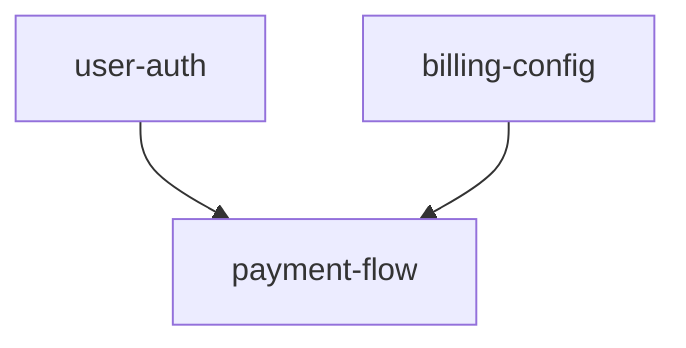

# Zettelgeist — Design Narrative

> **Note:** This is the original design narrative from before the v0.1 implementation. It captures the "why" and architectural intent. For the current state of the project, see [README.md](../README.md). For the formal spec, see [spec/zettelgeist-v0.1.md](../spec/zettelgeist-v0.1.md).

---

> *The geist is what lives in the cracks — the glue work between
> agentic coding, specs, humans, and the old agile flow.*
>
> **Zettelgeist** is a portable file format and contributor protocol
> for spec-driven, agent-friendly project management. It extends the
> converging file-based SDD conventions (Kiro, spec-kit, EARS) with a
> small set of markdown additions that turn a folder of specs into a
> navigable, agent-driveable project board — and a clickable surface
> non-coders can contribute to without ever leaving the repo.
>
> The format has two layers:
>
> - **Per-spec layer** — a folder of markdown files per spec
>   (`requirements.md`, `tasks.md`, `handoff.md`, plus an optional
>   `lenses/` folder for stakeholder perspectives like `design.md`,
>   `tech.md`, `business.md`). The core shape is what Kiro and
>   spec-kit are converging on. We're joining the convergence, not
>   replacing it.
> - **Project-management layer** — a handful of frontmatter fields
>   that turn specs into a graph (`depends_on`, `part_of`, `replaces`,
>   `merged_into`), plus one derived file per project (`INDEX.md`)
>   that acts as the at-a-glance dashboard. This is the actual addition.
>
> **Source of truth: markdown files in the repo.** Always. There is no
> external database, no hosted state, no API behind which the truth
> lives. Clone the repo and you have the entire project board.
>
> **Visualisation is agnostic.** A VSCode plugin, an Electron desktop
> app, a `npx zettelgeist` web app, a hosted view in any forge — anyone
> can build a GUI on top of the format because the format is the
> contract. The plan is to ship one reference surface as a worked
> example (likely a small web app built with TanStack Start or a
> VSCode plugin), but the format is the product, not the reference app.
>
> Status: design. Not built yet. To be split into a standalone repo
> once the format stabilises; this doc is the working sketch inside
> Forgitry while the ideas are still moving.

---

## The problem this is trying to solve

Three observations that drove the design:

1. **Issue trackers are misaligned with how AI actually works.** Jira, Linear,
   GitHub Projects all assume a human moves cards. An agent working on a
   ticket has to round-trip to an external API to update state — the state
   lives in a database, not next to the code. That round-trip is friction
   for agents and an integration tax for tooling.

2. **File-based SDD tools (Kiro, spec-kit, acai.sh, the broader
   "spec-driven dev" wave) get the file part right but punt on the
   stakeholder part.** Source of truth is `.md`/`.yml` in the repo —
   great for devs, great for agents, **invisible to non-coders**. POs,
   designers, and testers are not going to `git pull` and edit YAML.
   So in practice the spec files become a developer-only artefact and
   the org keeps using Jira anyway.

3. **CLI-first tools that wrap the old workflow hit the same wall
   twice.** WTF is a meaningful step toward structuring agentic work,
   but it inherits two pieces of legacy. The CLI surface is the
   visible one — 85% of non-engineering stakeholders see a terminal
   and bounce. The deeper one is the workflow shape underneath:
   tickets, estimates, sprints, swimlanes, handoffs between humans —
   agile as it was designed before LLMs existed, optimising for
   *human time as the scarce resource*. That constraint stops
   holding once agents do a meaningful share of the work. Wrapping a
   human-first workflow in a CLI doesn't make it agent-first; it
   makes the human-first workflow more scriptable. The interesting
   question is what the workflow shape *should* be once the
   constraint has changed — and that's the question Zettelgeist is
   trying to answer.

The bet: the file-based source of truth is correct. The missing layer
is a clickable surface on top of those files that non-coders can use,
without ever moving the source of truth out of the repo.

---

## The shift

> In a traditional project board, the board owns the state and humans move
> cards.
> In a Zettelgeist project, **the repo owns the state**. The board is a
> view that derives itself from files on every push.

Concretely:

- A spec is a folder of markdown files committed to the repo.
- Status is **computed** from file contents at read time — never stored
  independently.
- A board UI is a render of that computed view. Edits in the UI commit
  back to the files. There is no "board database" to drift from the repo.
- An agent doing the work and a human clicking through the board are
  modifying the **same files**. Same source of truth, different surfaces.

This is what makes the "cd in and git pull" view hold: clone the repo and
you have the entire board. Lose the hosting, lose the agent vendor, lose
whichever tool was rendering the view — the work survives, because the
work was never anywhere but in the repo.

---

## What a spec looks like

```
specs/
  user-auth/
    requirements.md   # what: EARS-style requirements + acceptance criteria
    tasks.md          # ordered checkbox list — the board reads this for status
    handoff.md        # agent-written: session summary, next step, blockers
    lenses/           # optional, additive perspectives
      design.md       # UX / interaction patterns
      tech.md         # architecture, data model, constraints
      business.md     # value, success metric, why-now
  payment-flow/
    requirements.md
    tasks.md          # lenses/ omitted for simple specs — fine
```

`tasks.md` is the only file the board strictly needs:

```markdown
# Tasks

- [x] 1. Add SAML 2.0 middleware to the auth package
- [x] 2. Add OIDC flow alongside SAML
- [ ] 3. Implement JIT user provisioning on first login
- [ ] 4. Write integration tests against a real IDP #human-only
- [ ] 5. Get legal sign-off on data retention wording #human-only
- [ ] 6. Consider adding WebAuthn in a follow-up #skip
```

Inline tags route work between humans and agents:

| Tag           | Meaning                                                                     |
|---------------|-----------------------------------------------------------------------------|
| `#human-only` | Agent skips. Board flags it as awaiting human action.                       |
| `#agent-only` | Humans can't tick it via the UI — agent must commit the check.              |
| `#skip`       | Not required. Ignored for progress. Used for noted future work.             |

Optional YAML frontmatter for explicit overrides:

```markdown
---
status: blocked
blocked_by: "Waiting on IDP vendor for test credentials"
auto_merge: true
---
```

That's the whole format. EARS in `requirements.md`, ordered checkboxes
in `tasks.md`, free-form prose in any `lenses/*.md`. None of this is
novel — the format borrows openly from Kiro, spec-kit, and EARS
notation. The contribution isn't the format, it's the **board on top
of the format**.

### On lenses

The `lenses/` subfolder is **strictly optional and additive**. A spec
may have no lenses, one lens, or many. The names `design.md`,
`tech.md`, `business.md` are *suggested canonical lenses* so surfaces
can render with familiar headings — but the format never requires
their presence and never restricts the set. Add `lenses/security.md`,
`lenses/legal.md`, `lenses/accessibility.md` as the work needs them.

The point is to give different stakeholders (designer, engineer, PO,
security reviewer) somewhere to write their perspective *without
colliding on a single `design.md`* — not to add a checklist of files
every spec must produce. A simple spec with just `requirements.md`
and `tasks.md` is a complete spec.

---

## Status is derived, not stored

| Status        | Condition                                                                  |
|---------------|----------------------------------------------------------------------------|
| `draft`       | Spec folder exists; tasks file absent or has no checkboxes                 |
| `planned`     | Tasks file has checkboxes, none checked, no live agent claim               |
| `in-progress` | Live agent claim, OR some checkboxes checked but not all                   |
| `in-review`   | All checkboxes checked, change not yet merged                              |
| `done`        | All checkboxes checked + change merged to default branch                   |
| `blocked`     | Frontmatter `status: blocked` (explicit override)                          |
| `cancelled`   | Frontmatter `status: cancelled` (explicit override)                        |

`blocked` and `cancelled` are the only states that can't be derived from
file content — everything else is computed from the git tree on each push.
A status cache may sit in front for performance, but it is always
recomputable and never the source of truth.

This is the bit that matters: there is **no schema migration** if the
format evolves. There is no separate "board state" to keep in sync.
The repo is the database.

---

## The project-management layer: spec graph + `INDEX.md`

A single spec folder is great. A *project* is many specs in
relationship to each other. That's where Zettelgeist adds something on
top of the converging single-spec format. The whole project-management
layer is two small markdown additions — nothing else.

### Part 1 — Frontmatter fields that turn specs into a graph

Each spec declares its own relationships in `requirements.md`
frontmatter:

```yaml
---
depends_on: [user-auth, billing-config]   # need these done first
part_of: payments-epic                    # grouping for higher-level views
replaces: legacy-checkout                 # this spec rewrote / split that one
merged_into: other-spec                   # this spec was deduped — redirect
---
```

**Adjacency-by-source.** Each spec declares its own outgoing edges.
Adding a spec adds its edges. Removing a spec removes its edges.
Renaming touches one folder. **No central edge list, no merge
conflicts on the graph itself** when two people add specs in parallel.
Same pattern as `package.json` `dependencies`: each unit declares what
it needs, the graph is derived.

The full graph at any moment is:

```text
graph = walk(specs/) → for each spec, parse frontmatter → collect edges
```

That's the entire data structure. There is nothing to serialise,
nothing to keep in sync, nothing to migrate. The graph is a **pure
function of the file tree**. Add a node = new folder. Add an edge =
one frontmatter line. The graph "exists" only in the moment a tool
walks the tree.

### Part 2 — One derived file: `specs/INDEX.md`

The graph alone isn't human-friendly to read. So Zettelgeist adds one
file: **`specs/INDEX.md`** with two clearly demarcated regions.

````markdown
# Specs Index

<!-- HUMAN-EDITED — reconciliation, decisions, cross-spec notes -->

## Decisions
- 2026-05-05: split user-auth out of identity-platform
- 2026-05-04: payment-flow tasks 3–5 reordered after design review

<!-- AUTO-GENERATED below — regenerated on push, do not edit -->

## State
| Spec         | Status      | Progress | Blocked by  |
|--------------|-------------|----------|-------------|
| user-auth    | in-progress | 3/5      | —           |
| payment-flow | blocked     | 0/8      | user-auth   |

## Graph


````

The **auto-generated region** is regenerated on every push by whatever
tool implements the format — table of all specs with status and
progress, mermaid graph rendered from the frontmatter edges. Two
conformant tools must produce byte-identical output for the same
repo state.

The **human-edited region** is for project-level context that doesn't
fit any single spec — design decisions that span specs, re-prioritisations,
retrospective notes. The reconciliation surface for the project as a
whole.

Both regions live in the same file because that's the file you open
when you want to know "where is this project at?" One destination,
two modes — human-curated context above, machine-generated state
below.

### What you get from this shape

- **Topological order = work order.** The next spec an agent should
  claim is the highest-priority node whose `depends_on` are all `done`.
  No scheduler needed; it's a graph walk over the frontmatter.
- **Cycle detection** runs at index regenerate — fail loud, never
  corrupt. Add a cyclic `depends_on` and the regen refuses, naming
  the cycle.
- **Reverse edges** (`blocks`) are inferred at index time. Declare
  `A depends_on B` once, in A; the index renders "B blocks A" derived,
  never duplicated.
- **Lifecycle** (split / merge / rename / dedupe) lives in the
  frontmatter of the affected spec, so `git log specs/<name>/` tells
  the full story of that node's life across reorganisations.
- **Hierarchy without nesting.** Folders stay flat; structure lives in
  `part_of` edges. `payment-flow part_of: payments-epic` clusters in
  `INDEX.md` without nesting `specs/payments-epic/payment-flow/`. One
  walk, one structure, no reconciliation between folder tree and
  dependency graph. (Code uses verticals — folders by feature — because
  code lives in a tree. Specs live in a graph; nesting them creates two
  structures the regen has to walk.)
- **Reconciliation surface** is the human-edited region of `INDEX.md`
  — project-level context that doesn't fit any single spec lives there.

### The mental model

Closer to a zettelkasten than a Jira board: atomic notes with their
own outgoing links, no master document, indices and graphs derived
from the collection. Luhmann's slip-box is the same data structure —
it just predates git by 50 years.

### The tradeoff

Regen walks every spec folder on each push. Fine for 50 specs, you'd
want a cache at 5,000. Cross that bridge later — the whole point is
"simple now."

---

## The non-coder bridge

This is where it tries to do something WTF and the file-first SDD tools
don't.

A board UI shows columns (`Draft / Planned / In Progress / In Review /
Done`) with one card per spec. Click a card and you get the spec detail:
`requirements.md`, `tasks.md`, `handoff.md`, and any `lenses/*.md`
rendered side by side, **inline-editable**.

Stakeholder actions, all driven through the UI:

| Action          | What it actually does                                                |
|-----------------|----------------------------------------------------------------------|
| Create spec     | Commits a new spec folder + `requirements.md` stub                   |
| Edit a file     | Inline editor, commits on save                                       |
| Run agent       | Creates a claim, kicks off an agent run                              |
| Stop agent      | Kills execution; agent writes partial `handoff.md` before exiting    |
| Mark blocked    | Adds `status: blocked` to frontmatter (a commit)                     |
| Tick a task     | Edits `tasks.md` to check the box (a commit)                         |
| Cancel          | Adds `status: cancelled` to frontmatter (a commit)                   |

Every UI action ends in a commit. A PO ticking off "design approved" is
the same operation, mechanically, as an agent ticking off "JIT
provisioning implemented." The audit log is `git log`. There is no
shadow state.

The path forward for stakeholder uplift: today, clicking. Tomorrow,
when they're comfortable, they can open a markdown file and edit it
directly. The skill ramp is gradual instead of binary.

### The contribution shape

Every UI action ends in a commit — true for both agents and humans.
But humans-who-aren't-git-fluent shouldn't have to think about pulls,
conflicts, or main-branch hygiene to contribute a correction or a
comment. The format doesn't obfuscate git; the **surface** chooses
how much git to expose:

- **Pro surfaces** (IDE plugin, terminal, advanced web view) treat
  the user as a git operator. "Save" means "commit + push to current
  branch", and the user owns conflict resolution.
- **Beginner surfaces** (PO/designer/tester web view, mobile) treat
  every edit as a **suggestion** — committed to a personal draft
  branch, never direct-to-main. A reviewer (human or agent) merges
  the suggestion in. Beginners can't race main and therefore can't
  conflict on history they didn't write.

Same model as Wikipedia talk pages, Google Docs Suggesting mode, and
GitHub's web editor's "Create new branch for this commit" default.
The mechanism (git) is unchanged; the *default workflow* protects
the user from races they don't yet have the context to handle.

This is also the clean answer to "what happens when a non-git user
hasn't pulled and creates a tangled history?" They never had write
access to main in the first place. Their work lives on a draft branch
until someone with the context says "yes, fold this in."

Surfaces declare their default in their own docs; the format only
requires that *every* edit produce a commit somewhere. Whether that
commit lands on `main` or `suggestions/<user>/<timestamp>` is the
surface's call.

---

## What you need to know to contribute

The format aims for a low literacy floor, but "low" is not "zero."
Two skill axes worth being honest about.

**Technical floor — edit a markdown file.** That's it. Everything
else (git, branches, push, PR, conflict resolution) is GUI-abstractable
for the contributor tier — see the contribution shape above. If you
can use the comment box on a Google Doc, you can contribute to a
Zettelgeist spec through a beginner surface.

**Semantic floor — understand what a good spec is.** This one the
GUI cannot abstract away. Knowing *what to write in `requirements.md`*
or *what makes `lenses/design.md` useful three months later* is taste,
not tooling. Spec-driven workflow is a discipline distinct from
ticket-driven agile, and people who've only worked in Jira often
don't have the muscle for it yet.

The format scaffolds the discipline:

- **Templates.** A spec stub with the right headings is closer to a
  finished spec than a blank page is.
- **Examples.** The reference repo ships a handful of well-formed
  specs people can copy-and-deform.
- **LLM-assisted drafting.** "I want to add SAML auth" → an LLM
  drafts `requirements.md` and `tasks.md` from a template. The human
  edits for accuracy. Markdown is the friendliest input/output format
  an LLM has, which is part of why this works.

But scaffolding doesn't replace taste. Markdown didn't make people
write well; Zettelgeist won't make people spec well. The honest
framing of who this is for: **teams that want to do spec-driven work
and need the tooling to fit the discipline** — not teams that want
the tooling to *create* the discipline for them.

---

## Why agents like this format

A managed agent (or a local Claude Code / Cursor / whatever) executing a
spec follows a simple loop:

1. **Claim** — write `specs/<name>/.claim` (agent ID + timestamp). The
   claim is held in live execution state, not committed — claims are
   ephemeral, not history.
2. **Orient** — read `handoff.md` if present, then
   `requirements.md`, `tasks.md`, and any `lenses/*.md` available.
3. **Branch** — create a git branch (or jj change) named `spec/<name>`.
4. **Execute** — work through `tasks.md` top to bottom. After each task:
   tick the box, commit, push. Board updates on push.
5. **Handoff** — at context limit or natural pause, write `handoff.md`
   and commit. The next session picks up from there.
6. **Complete** — all non-`#skip` boxes ticked, all `#human-only` boxes
   either ticked by a human or flagged as awaiting. Open a PR / change.
7. **Merge** — auto-merge if the spec opted in, otherwise wait for human
   review.

`handoff.md` is the bit borrowed from continuous-claude-v3's continuity
ledger pattern, adapted to per-spec scope:

```markdown
# Handoff — user-auth — 2026-05-05T14:32Z

## What was done this session
- Completed tasks 1–3: SAML middleware, OIDC flow, JIT provisioning
- Tests for tasks 1–3 passing

## Next step
- Task 4: integration tests against a real IDP. Need test IDP creds.
  Using mocksaml as workaround until real creds arrive.

## Context for next session
- Auth middleware lives in internal/auth/middleware.go
- OIDC config in internal/auth/config.go:LoadOIDCConfig
- Test setup uses testcontainers — see internal/auth/auth_test.go

## Blockers
None — using mocksaml for task 4.
```

Two properties matter here:

- **The agent's working memory is a committed file.** A human reading the
  board can see exactly where the agent is and why. There is no
  "ask the agent to summarise" — the summary is in the repo.
- **Multi-session work is the default, not an edge case.** Context limits
  are real. Long features take days. Rather than papering over that,
  the format makes session boundaries first-class.

---

## Events: webhooks + MCP

Every state transition emits an event:

| Event                 | When                                                          |
|-----------------------|---------------------------------------------------------------|
| `spec.created`        | New spec folder appears on push                               |
| `spec.started`        | Agent claimed a spec                                          |
| `spec.task.completed` | A checkbox was ticked + committed                             |
| `spec.task.skipped`   | An agent encountered a `#human-only` or `#skip` task          |
| `spec.blocked`        | `status: blocked` written                                     |
| `spec.unblocked`      | `status: blocked` removed                                     |
| `spec.review`         | All non-`#skip` tasks done, change opened                     |
| `spec.done`           | Change merged                                                 |
| `spec.cancelled`      | `status: cancelled` written                                   |
| `spec.agent.stopped`  | Agent exited (human action or crash)                          |

Delivered two ways:

- Plain HTTP webhooks (Slack, custom automation, your CI of choice).
- An MCP event stream, so external agents that already speak MCP to the
  repo see spec events alongside push and CI events without needing a
  separate subscription.

---

## One format, many surfaces

Everything above describes a **file format**, not a tool. Once it's
formalised — versioned schema for the frontmatter fields, deterministic
rules for regenerating `INDEX.md`, an event catalogue with frozen
payload shapes, a conformance test suite — anyone can build a surface
on top of it.

That's what Zettelgeist actually is: a **portable protocol** for
spec-driven, agent-friendly project management. Not a single tool.

**The plan is to ship one reference surface as a worked example** —
likely a standalone web app built with TanStack Start that you can
`npx`-run against any folder, or self-host. It demonstrates the format
is implementable end-to-end and gives non-coders a click view from
day one. But the reference app is just one possible surface; the
intent from the start is for other tools — IDE plugins, desktop apps,
hosted views in any forge — to implement the same format independently.

The surfaces that fall out of formalisation:

- **IDE plugins** (VSCode, JetBrains, Zed, Neovim). Sidebar shows the
  spec tree with status badges. Tick checkboxes from the editor. Run
  agent on the current spec. The developer's daily surface.
- **Local desktop or web app** (Tauri, Electron, or `npx zettelgeist`
  built with TanStack Start / Vite). Point at any folder, get the
  board view, no server needed. The friendliest entry for POs,
  designers, testers who just want a click view.
- **Hosted web apps.** Any forge or PM tool can ship one — GitHub,
  GitLab, Linear, a self-hosted forge, a brand new project that's just
  a Zettelgeist renderer. Compete on UX, not on data lock-in.
- **CLI surfaces** for terminal workflows and scripts. With the format
  underneath, **WTF becomes a natural CLI for Zettelgeist** rather than
  a competing workflow shape.
- **Mobile**, eventually. Read-mostly. Tick boxes from the couch on
  the way home.

The analogy is **LSP for project management**. Editor and language
vendors stopped doing N×M integrations once the Language Server
Protocol existed — a Python LSP works in any LSP-compliant editor,
full stop. Same dynamic here: agent vendors (Claude, Cursor, custom
runners) and UI vendors (any forge, any IDE plugin, any local app)
meet at the file format and never need to know about each other.

Other formats that won by being implementable by anyone:
`.editorconfig`, OpenAPI, Markdown itself, robots.txt. The common
thread is **the spec is small enough to read in one sitting** and
**the conformance surface is small enough that ten tools can
implement it without fragmenting**. Zettelgeist should aim for that.

What "formalising" means concretely:

- A versioned (semver) schema for the frontmatter fields on each file
  type — `requirements.md`, `tasks.md`, `handoff.md`, `INDEX.md`.
- Deterministic, idempotent regeneration rules for the auto-generated
  region of `INDEX.md`. Two conformant tools must produce
  byte-identical output on the same repo.
- The event catalogue with frozen payload shapes (already drafted).
- A conformance fixture suite — small repos with expected board
  states; new tools validate against them.
- A reference parser library, probably in Go and TypeScript. Other
  tools can call it or reimplement; both are fine.

None of this is heavy. The whole format spec likely fits in one
markdown file the size of `.editorconfig`'s. The reference library is
a parser plus an `INDEX.md` regenerator. The conformance suite is a
folder of fixture repos.

This is also the cleanest answer to "what happens if any single tool
dies?" An open format with multiple implementations survives the loss
of any one surface. The work outlives the tool.

---

## What this is consciously not

- **Not vibe-kanban.** vibe-kanban is an agent dispatcher: it manages
  sandboxes and assigns work. Zettelgeist is a **work format**: it
  defines what work is, in such a way that any agent (managed, local,
  third-party) can execute it. They could plausibly compose — vibe-kanban
  could pick up a Zettelgeist spec and run it.
- **Not WTF in a webview.** The workflow shape steps away from
  ticket-shaped flows: no estimates, story points, swimlanes-by-assignee,
  or sprint ceremonies. The unit of work is "a spec the agent takes
  from intent to merged change," not "a ticket passed between humans."
  (WTF the CLI could implement the format and become a surface for
  it — the format and the workflow shape are separable.)
- **Not acai.sh / Kiro hosted.** The repo is the source of truth. Any
  tool is just one place that renders the view. Lose the tool, the
  work survives.
- **Not on by default.** A repo with no `.zettelgeist.yaml` (dotfile
  convention, like `.editorconfig`; final filename TBD) is invisible
  to spec-aware tools. The format presence in a repo is opt-in: commit
  the config and the board lights up. No file, no board.
- **Not a replacement for AGENTS.md / CLAUDE.md.** Those are codebase
  context. Spec folders are work-to-do. They coexist.

---

## Open questions / where I'm not sure

A non-exhaustive list of things this design has *not* solved, in case
they spark something:

- **Claim-time policy on blocked specs.** With `depends_on` in frontmatter
  the graph is well-defined, but the agent policy isn't. Should an agent
  refuse to claim a blocked spec? Allow drafting (read + comment) but not
  execution? Allow speculative implementation against an
  assumed-stable upstream? Probably configurable, but I haven't decided
  the default.
- **Richer editing surface for non-engineers.** The contribution model
  (suggestion-branches by default) handles the *git* problem. It
  doesn't handle the *content* problem: requirements often want image
  embeds, Figma links, decision tables, structured fields. Plain
  markdown is the floor; how much editor sugar a beginner surface can
  add without leaving the format is open.
- **Spec discovery / spec graph at scale.** Once a repo has 50 specs,
  the column view stops scaling. A graph view that surfaces clusters,
  dependencies, and "what's been touched recently" probably becomes the
  primary surface — but I haven't designed that.
- **Multi-repo specs.** A feature that spans two services is two spec
  folders in two repos with no shared identity. An org-level board that
  unions across repos is the obvious answer, but inherits the dependency
  problem above.
- **Reconciliation when the agent and a human edit the same `tasks.md`
  in parallel.** Standard git conflict resolution applies, but the agent
  needs to handle "I came back from a context refresh and the file moved
  under me" gracefully.
- **Suggestion-branch lifecycle.** The contribution model puts beginner
  edits on draft branches. What happens when those branches are
  abandoned? Auto-GC after N days? Surface them as "stale suggestions"?
  How does a reviewer audit 17 pending suggestions from one PO without
  getting lost? Open.
- **Where opinionated workflow lives.** Cadence beliefs (ship within
  ~2 weeks, retire stale specs, follow DORA-shaped flow) are workflow
  opinions, not format facts. Current intent: keep them in a separate
  `zettelgeist-practices.md` doc so the format spec stays neutral and
  adopters can take or leave the opinions independently. Open whether
  that doc lives in this repo or has its own life.

If any of these snag at something you've already thought about, that's
probably where the genuinely new ideas live.

---

## Why I'm sharing this

Two reasons:

1. **You've already done the hard part of looking at this problem
   honestly.** WTF exists because you saw the same gap. The format
   above is more or less what falls out if you take WTF's structure,
   strip the parts that mimic Jira, and add a clickable surface for
   non-coders. A lot of this is your problem statement with my
   framing on top.
2. **The bit that's actually missing — the click surface that
   stakeholders use without knowing they're committing markdown — is
   bigger than any one tool.** The format above is portable on
   purpose. A standalone "Zettelgeist for any git repo" is a coherent
   product on its own, and that might be the more interesting shape
   than any single tool fronting it.

If any of this lands wrong, push back hard. The design is uncommitted
in both senses — no code yet, and no ego attached.
