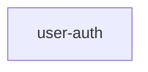
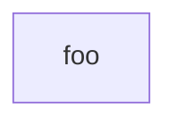
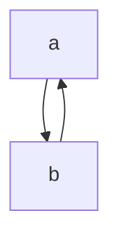
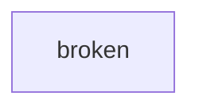

# Zettelgeist v0.1 — Plan 1: Format Spec + Core + Conformance

> **For agentic workers:** REQUIRED SUB-SKILL: Use superpowers:subagent-driven-development (recommended) or superpowers:executing-plans to implement this plan task-by-task. Steps use checkbox (`- [ ]`) syntax for tracking.

**Goal:** Build the foundational TS core library (`packages/core/`), the normative format spec doc (`spec/zettelgeist-v0.1.md`), and a runnable conformance fixture suite. No surfaces (extension, MCP) in this plan — those are Plans 2–4.

**Architecture:** pnpm-workspace monorepo. `packages/core/` is pure TypeScript with no I/O dependencies — all filesystem access is injected. Conformance fixtures at `spec/conformance/fixtures/<NN-name>/{input/, expected/}` are loaded by a Node harness at `spec/conformance/harness/` and asserted against `core`'s outputs. The fixtures are simultaneously the contract for any conformant implementation and our own test corpus. The format spec doc is written incrementally alongside features, with a rule→fixture map at the end.

**Tech Stack:**
- TypeScript 5.x (strict, NodeNext, ES2022)
- pnpm 9.x workspaces
- Vitest (test runner, ESM-native)
- gray-matter (frontmatter parsing; pulls in js-yaml transitively)
- Node 20+

**Out of scope for this plan:** MCP server, VSCode extension, pre-commit hook, CI workflow, `zettelgeist` CLI binary. Those land in Plans 2–4.

---

## File Structure

Files this plan creates or modifies:

| Path | Responsibility |
|---|---|
| `pnpm-workspace.yaml` | Declare workspace packages |
| `package.json` | Root scripts, devDependencies (TypeScript, Vitest) |
| `tsconfig.base.json` | Shared TS compiler options |
| `.gitignore` | Node artifacts, build outputs, `.claim` files |
| `.zettelgeist.yaml` | We dogfood our own format (final task) |
| `packages/core/package.json` | Core package metadata |
| `packages/core/tsconfig.json` | Extends base; emit dts |
| `packages/core/src/index.ts` | Public exports |
| `packages/core/src/types.ts` | `Spec`, `Status`, `Task`, `ValidationError`, `Graph`, `RepoState` |
| `packages/core/src/frontmatter.ts` | `parseFrontmatter()` |
| `packages/core/src/tasks.ts` | `parseTasks()` |
| `packages/core/src/loader.ts` | `loadSpec()`, `loadAllSpecs()`, `FsReader` interface |
| `packages/core/src/status.ts` | `deriveStatus()` |
| `packages/core/src/graph.ts` | `buildGraph()`, cycle detection |
| `packages/core/src/validate.ts` | `validateRepo()` |
| `packages/core/src/regen.ts` | `regenerateIndex()` |
| `packages/core/tests/*.test.ts` | Unit tests for each module |
| `spec/zettelgeist-v0.1.md` | Normative spec doc |
| `spec/conformance/fixtures/<NN-name>/input/...` | Fixture inputs (markdown repos) |
| `spec/conformance/fixtures/<NN-name>/expected/{statuses,graph,validation}.json` | Expected derived state |
| `spec/conformance/fixtures/<NN-name>/expected/INDEX.md` | Expected byte-exact INDEX.md |
| `spec/conformance/harness/package.json` | Harness package metadata |
| `spec/conformance/harness/run.ts` | Harness entrypoint |
| `spec/conformance/harness/conformance.test.ts` | Vitest test that runs all fixtures |

---

### Task 1: Monorepo skeleton

**Files:**
- Create: `pnpm-workspace.yaml`
- Create: `package.json`
- Create: `tsconfig.base.json`
- Create: `.gitignore`

- [ ] **Step 1: Create `pnpm-workspace.yaml`**

```yaml
packages:
  - 'packages/*'
  - 'spec/conformance/harness'
```

- [ ] **Step 2: Create root `package.json`**

```json
{
  "name": "zettelgeist",
  "version": "0.1.0",
  "private": true,
  "type": "module",
  "scripts": {
    "build": "pnpm -r build",
    "test": "pnpm -r test",
    "typecheck": "pnpm -r typecheck",
    "conformance": "pnpm --filter @zettelgeist/conformance-harness test"
  },
  "devDependencies": {
    "typescript": "^5.6.0",
    "vitest": "^2.1.0",
    "@types/node": "^20.0.0"
  },
  "packageManager": "pnpm@9.12.0"
}
```

- [ ] **Step 3: Create `tsconfig.base.json`**

```json
{
  "compilerOptions": {
    "target": "ES2022",
    "module": "NodeNext",
    "moduleResolution": "NodeNext",
    "strict": true,
    "esModuleInterop": true,
    "skipLibCheck": true,
    "declaration": true,
    "sourceMap": true,
    "noUncheckedIndexedAccess": true,
    "exactOptionalPropertyTypes": true,
    "forceConsistentCasingInFileNames": true,
    "resolveJsonModule": true
  }
}
```

- [ ] **Step 4: Create `.gitignore`**

```gitignore
node_modules/
dist/
*.tsbuildinfo
.DS_Store
.claim
```

- [ ] **Step 5: Install and verify**

Run: `pnpm install`
Expected: success, no warnings about missing packages (workspace is empty but valid).

- [ ] **Step 6: Commit**

```bash
git add pnpm-workspace.yaml package.json tsconfig.base.json .gitignore
git commit -m "chore: scaffold pnpm monorepo"
```

---

### Task 2: Core package skeleton

**Files:**
- Create: `packages/core/package.json`
- Create: `packages/core/tsconfig.json`
- Create: `packages/core/tsconfig.build.json`
- Create: `packages/core/src/index.ts`
- Create: `packages/core/src/types.ts`
- Create: `packages/core/tests/sanity.test.ts`

- [ ] **Step 1: Create `packages/core/package.json`**

```json
{
  "name": "@zettelgeist/core",
  "version": "0.1.0",
  "private": true,
  "type": "module",
  "main": "./dist/index.js",
  "types": "./dist/index.d.ts",
  "exports": {
    ".": {
      "import": "./dist/index.js",
      "types": "./dist/index.d.ts"
    }
  },
  "scripts": {
    "build": "tsc -p tsconfig.build.json",
    "typecheck": "tsc -p tsconfig.json",
    "test": "vitest run"
  },
  "dependencies": {
    "gray-matter": "^4.0.3"
  }
}
```

- [ ] **Step 2: Create two TS configs — one for IDE+typecheck, one for build**

`packages/core/tsconfig.json` (IDE + typecheck — includes tests, never emits):

```json
{
  "extends": "../../tsconfig.base.json",
  "compilerOptions": {
    "noEmit": true
  },
  "include": ["src/**/*", "tests/**/*"]
}
```

`packages/core/tsconfig.build.json` (build only — src only, emits dist):

```json
{
  "extends": "./tsconfig.json",
  "compilerOptions": {
    "noEmit": false,
    "outDir": "dist",
    "rootDir": "src"
  },
  "include": ["src/**/*"]
}
```

Why split: tests live under `tests/` not `src/`. If we include them in the build config, they'd emit to `dist/`. If we exclude them from any config, the IDE language server treats them as orphan files and can't resolve cross-file imports. The split gives the IDE/typecheck a config that knows about tests (no emit) and the build a config that emits only `src/`.

- [ ] **Step 3: Create `packages/core/src/types.ts`**

```ts
export type Status =
  | 'draft'
  | 'planned'
  | 'in-progress'
  | 'in-review'
  | 'done'
  | 'blocked'
  | 'cancelled';

export interface Task {
  /** 1-indexed position in tasks.md */
  index: number;
  checked: boolean;
  text: string;
  tags: ReadonlyArray<'#human-only' | '#agent-only' | '#skip'>;
}

export interface SpecFrontmatter {
  status?: 'blocked' | 'cancelled';
  blocked_by?: string;
  depends_on?: string[];
  part_of?: string;
  replaces?: string;
  merged_into?: string;
  auto_merge?: boolean;
  /** Any other fields are preserved but not interpreted. */
  [key: string]: unknown;
}

export interface Spec {
  name: string;
  frontmatter: SpecFrontmatter;
  requirements: string | null;
  tasks: ReadonlyArray<Task>;
  handoff: string | null;
  lenses: ReadonlyMap<string, string>;
}

export interface RepoState {
  /** Spec names that have a `.claim` file present and not stale. */
  claimedSpecs: ReadonlySet<string>;
  /** Spec names whose changes are merged to the default branch. */
  mergedSpecs: ReadonlySet<string>;
}

export type ValidationError =
  | { code: 'E_CYCLE'; path: string[] }
  | { code: 'E_INVALID_FRONTMATTER'; path: string; detail: string }
  | { code: 'E_EMPTY_SPEC'; path: string };

export interface GraphNode {
  name: string;
  partOf: string | null;
}

export interface GraphEdge {
  /** depends_on edge: from → to means `from` depends on `to`. */
  from: string;
  to: string;
}

export interface Graph {
  nodes: ReadonlyArray<GraphNode>;
  edges: ReadonlyArray<GraphEdge>;
  /** Reverse `depends_on` edges, derived. */
  blocks: ReadonlyArray<GraphEdge>;
  /** Each cycle is an ordered list of spec names; the cycle closes back to the first. */
  cycles: ReadonlyArray<string[]>;
}
```

- [ ] **Step 4: Create `packages/core/src/index.ts`**

```ts
export * from './types.js';
```

- [ ] **Step 5: Create `packages/core/tests/sanity.test.ts`**

```ts
import { expect, test } from 'vitest';
import type { Status } from '../src/index.js';

test('Status type compiles and re-exports cleanly', () => {
  const s: Status = 'draft';
  expect(s).toBe('draft');
});
```

- [ ] **Step 6: Install and run tests**

Run: `pnpm install && pnpm --filter @zettelgeist/core test`
Expected: 1 test passes.

- [ ] **Step 7: Commit**

```bash
git add pnpm-lock.yaml packages/core
git commit -m "feat(core): scaffold package with types"
```

---

### Task 3: Spec doc skeleton (sections 1–3)

**Files:**
- Create: `spec/zettelgeist-v0.1.md`

- [ ] **Step 1: Create the spec doc with Status, Abstract, and Conventions**

```markdown
# Zettelgeist Format Specification — v0.1

- **Status:** Draft
- **Format version:** 0.1
- **Date:** 2026-05-06

## 1. Abstract

Zettelgeist is a portable file format for spec-driven, agent-friendly project management. A repository opts into the format by committing a `.zettelgeist.yaml` file at the repo root. Spec folders under `specs/` carry markdown files (`requirements.md`, `tasks.md`, `handoff.md`, optional `lenses/*.md`) whose contents and YAML frontmatter define the project's work, status, and graph relationships. Status is derived from file contents on each read; it is never stored independently.

This document is the normative specification for v0.1. Implementations in any language MAY exist; conformance is defined by passing the fixture suite at `spec/conformance/fixtures/`.

## 2. Conventions

The key words "MUST", "MUST NOT", "REQUIRED", "SHALL", "SHALL NOT", "SHOULD", "SHOULD NOT", "RECOMMENDED", "MAY", and "OPTIONAL" in this document are to be interpreted as described in RFC 2119.

YAML in this document refers to YAML 1.2. CommonMark refers to the CommonMark 0.30 specification. Filesystem paths use forward slashes regardless of host OS. Line endings are LF; implementations MAY accept CRLF on input but MUST emit LF.

## 3. Repository opt-in (`.zettelgeist.yaml`)

A repository is a Zettelgeist repository if and only if a file named `.zettelgeist.yaml` exists at the repository root. Implementations MUST treat repositories without this file as outside the format's scope.

The file MUST be valid YAML and MUST contain at least:

```yaml
format_version: "0.1"
```

Optional fields:

- `specs_dir` (string, default `"specs"`) — relative path to the directory containing spec folders.
- `default_branch` (string, default detected from git) — the branch on which merged work counts as `done`.

Unknown top-level fields MUST be preserved but MAY be ignored.

If `format_version` is missing or not a string, implementations MUST emit `E_INVALID_FRONTMATTER` (the error applies to `.zettelgeist.yaml` itself, with `path = ".zettelgeist.yaml"`).

If `format_version` is a recognized format the implementation supports, processing continues. If it is a different value, implementations SHOULD emit a warning and MAY continue best-effort processing.

## 4. Spec folder structure

(filled in by a later task)

## 5. Frontmatter schema

(filled in by a later task)

## 6. Inline task tags

(filled in by a later task)

## 7. Status derivation

(filled in by a later task)

## 8. Spec graph

(filled in by a later task)

## 9. `INDEX.md` regeneration

(filled in by a later task)

## 10. Validation errors

(filled in by a later task)

## 11. Conformance

(filled in by a later task)

## 12. Versioning

(filled in by a later task)

## 13. Future work (non-normative)

(filled in by a later task)

## Appendix A. Rule → fixture map

(filled in by the final task)
```

- [ ] **Step 2: Verify file renders**

Run: `head -40 spec/zettelgeist-v0.1.md`
Expected: see the Status/Abstract/Conventions content.

- [ ] **Step 3: Commit**

```bash
git add spec/zettelgeist-v0.1.md
git commit -m "docs(spec): add normative spec skeleton with sections 1-3"
```

---

### Task 4: Conformance harness skeleton + fixture 01 (empty repo)

This task wires up the harness end-to-end with the simplest possible fixture: a repo with only `.zettelgeist.yaml` and no specs. By the end of this task, the harness loads fixtures, calls `core` (which still has nothing implemented), and the test fails — proving the loop works. Tasks 5+ make it pass.

**Files:**
- Create: `spec/conformance/harness/package.json`
- Create: `spec/conformance/harness/tsconfig.json`
- Create: `spec/conformance/harness/vitest.config.ts`
- Create: `spec/conformance/harness/src/run.ts`
- Create: `spec/conformance/harness/tests/conformance.test.ts`
- Create: `spec/conformance/fixtures/01-empty-repo/input/.zettelgeist.yaml`
- Create: `spec/conformance/fixtures/01-empty-repo/expected/statuses.json`
- Create: `spec/conformance/fixtures/01-empty-repo/expected/graph.json`
- Create: `spec/conformance/fixtures/01-empty-repo/expected/validation.json`
- Create: `spec/conformance/fixtures/01-empty-repo/expected/INDEX.md`
- Modify: `packages/core/src/index.ts` — add `runConformance(repoFs)` placeholder
- Modify: `packages/core/src/loader.ts` (new file) — `FsReader` interface

- [ ] **Step 1: Add `FsReader` interface and `runConformance` to core**

Create `packages/core/src/loader.ts`:

```ts
export interface FsReader {
  /** List entries (files and directories) at a path. Paths use forward slashes, relative to repo root. */
  readDir(path: string): Promise<Array<{ name: string; isDir: boolean }>>;
  /** Read a UTF-8 file. Throws if missing. */
  readFile(path: string): Promise<string>;
  /** Check if a path exists (file or dir). */
  exists(path: string): Promise<boolean>;
}
```

Modify `packages/core/src/index.ts`:

```ts
export * from './types.js';
export type { FsReader } from './loader.js';

import type { FsReader } from './loader.js';
import type { Graph, Spec, Status, ValidationError } from './types.js';

export interface ConformanceOutput {
  statuses: { specs: Record<string, Status> };
  graph: { nodes: Graph['nodes']; edges: Graph['edges']; cycles: Graph['cycles'] };
  validation: { errors: ValidationError[] };
  index: string;
}

/**
 * Run the full conformance pipeline against a virtual repo. Used by the harness
 * and by `core`'s tests. Each subsystem implementation will be wired in here.
 */
export async function runConformance(_fs: FsReader): Promise<ConformanceOutput> {
  // Tasks 5+ replace this with the real pipeline.
  throw new Error('runConformance: not yet implemented');
}
```

Run: `pnpm --filter @zettelgeist/core typecheck`
Expected: success.

- [ ] **Step 2: Create fixture 01**

`spec/conformance/fixtures/01-empty-repo/input/.zettelgeist.yaml`:

```yaml
format_version: "0.1"
```

`spec/conformance/fixtures/01-empty-repo/expected/statuses.json`:

```json
{
  "specs": {}
}
```

`spec/conformance/fixtures/01-empty-repo/expected/graph.json`:

```json
{
  "nodes": [],
  "edges": [],
  "cycles": []
}
```

`spec/conformance/fixtures/01-empty-repo/expected/validation.json`:

```json
{
  "errors": []
}
```

`spec/conformance/fixtures/01-empty-repo/expected/INDEX.md`:

```
<!-- ZETTELGEIST:AUTO-GENERATED BELOW — do not edit -->

## State

_No specs._

## Graph

_No specs._
```

(Note: ends with a single trailing newline. Byte-exact comparison includes this.)

- [ ] **Step 3: Create harness package**

`spec/conformance/harness/package.json`:

```json
{
  "name": "@zettelgeist/conformance-harness",
  "version": "0.1.0",
  "private": true,
  "type": "module",
  "scripts": {
    "test": "vitest run",
    "typecheck": "tsc -p tsconfig.json --noEmit"
  },
  "dependencies": {
    "@zettelgeist/core": "workspace:*"
  },
  "devDependencies": {
    "vitest": "^2.1.0",
    "@types/node": "^20.0.0"
  }
}
```

`spec/conformance/harness/tsconfig.json`:

```json
{
  "extends": "../../../tsconfig.base.json",
  "compilerOptions": {
    "noEmit": true,
    "baseUrl": ".",
    "paths": {
      "@zettelgeist/core": ["../../../packages/core/src/index.ts"]
    }
  },
  "include": ["src/**/*", "tests/**/*", "vitest.config.ts"]
}
```

Why `paths` here mirrors the vitest alias: `tsc` doesn't read `vitest.config.ts`, so without an explicit path mapping it resolves `@zettelgeist/core` to `dist/index.d.ts` — which doesn't exist before a build. Both vitest (runtime) and tsc (typecheck) need to point at the same source file. `noEmit: true` because the harness never produces compiled output (vitest handles its own compilation).

`spec/conformance/harness/vitest.config.ts` (resolves `@zettelgeist/core` to source so the harness runs without a prior build of core):

```ts
import { defineConfig } from 'vitest/config';
import * as path from 'node:path';
import { fileURLToPath } from 'node:url';

const here = path.dirname(fileURLToPath(import.meta.url));

export default defineConfig({
  resolve: {
    alias: {
      '@zettelgeist/core': path.resolve(here, '../../../packages/core/src/index.ts'),
    },
  },
});
```

- [ ] **Step 4: Create the disk-backed `FsReader` in the harness**

`spec/conformance/harness/src/run.ts`:

```ts
import { promises as fs } from 'node:fs';
import * as path from 'node:path';
import type { FsReader } from '@zettelgeist/core';

export function makeDiskFsReader(rootDir: string): FsReader {
  const resolve = (p: string) => path.join(rootDir, p);
  return {
    async readDir(p) {
      const entries = await fs.readdir(resolve(p), { withFileTypes: true });
      return entries.map((e) => ({ name: e.name, isDir: e.isDirectory() }));
    },
    async readFile(p) {
      return fs.readFile(resolve(p), 'utf8');
    },
    async exists(p) {
      try {
        await fs.stat(resolve(p));
        return true;
      } catch {
        return false;
      }
    },
  };
}
```

- [ ] **Step 5: Create the conformance test that iterates fixtures**

`spec/conformance/harness/tests/conformance.test.ts`:

```ts
import { promises as fsp, readdirSync } from 'node:fs';
import * as path from 'node:path';
import { fileURLToPath } from 'node:url';
import { describe, expect, it } from 'vitest';
import { runConformance } from '@zettelgeist/core';
import { makeDiskFsReader } from '../src/run.js';

const here = path.dirname(fileURLToPath(import.meta.url));
const FIXTURES_DIR = path.resolve(here, '../../fixtures');

const fixtureNames = readdirSync(FIXTURES_DIR, { withFileTypes: true })
  .filter((e) => e.isDirectory())
  .map((e) => e.name)
  .sort();

describe('conformance fixtures', () => {
  for (const name of fixtureNames) {
    it(name, async () => {
      const fixtureDir = path.join(FIXTURES_DIR, name);
      const inputDir = path.join(fixtureDir, 'input');
      const expectedDir = path.join(fixtureDir, 'expected');

      const reader = makeDiskFsReader(inputDir);
      const actual = await runConformance(reader);

      const expectedStatuses = JSON.parse(await fsp.readFile(path.join(expectedDir, 'statuses.json'), 'utf8'));
      const expectedGraph = JSON.parse(await fsp.readFile(path.join(expectedDir, 'graph.json'), 'utf8'));
      const expectedValidation = JSON.parse(await fsp.readFile(path.join(expectedDir, 'validation.json'), 'utf8'));
      const expectedIndex = await fsp.readFile(path.join(expectedDir, 'INDEX.md'), 'utf8');

      // Validation errors are matched on { code, path } only — strip other fields per spec §11.
      const stripDetails = (errs: unknown[]): unknown[] =>
        (errs as Array<Record<string, unknown>>).map(({ code, path: p }) => ({ code, path: p }));

      expect(actual.statuses).toEqual(expectedStatuses);
      expect(actual.graph).toEqual(expectedGraph);
      expect(stripDetails(actual.validation.errors)).toEqual(stripDetails(expectedValidation.errors));
      expect(actual.index).toBe(expectedIndex); // byte-exact
    });
  }
});
```

Why `readdirSync`: vitest's `describe`/`it` block needs to register tests synchronously during module load. Using top-level `await` for fixture discovery would work, but a synchronous read is clearer and avoids the ESM top-level-await edge cases some test runners hit.

Why the `stripDetails` helper: per spec §11, validation errors compare on `{code, path}` only. The implementation may include extra fields (like `detail` for `E_INVALID_FRONTMATTER`), but those are excluded from the conformance comparison.

- [ ] **Step 6: Install and run — expect failure**

Run: `pnpm install && pnpm conformance`
Expected: test for `01-empty-repo` fails with `runConformance: not yet implemented`.

- [ ] **Step 7: Implement minimum `runConformance` to make fixture 01 pass**

Modify `packages/core/src/index.ts`:

```ts
export * from './types.js';
export type { FsReader } from './loader.js';

import type { FsReader } from './loader.js';
import type { Graph, Status, ValidationError } from './types.js';

export interface ConformanceOutput {
  statuses: { specs: Record<string, Status> };
  graph: { nodes: Graph['nodes']; edges: Graph['edges']; cycles: Graph['cycles'] };
  validation: { errors: ValidationError[] };
  index: string;
}

const EMPTY_INDEX =
  '<!-- ZETTELGEIST:AUTO-GENERATED BELOW — do not edit -->\n' +
  '\n' +
  '## State\n' +
  '\n' +
  '_No specs._\n' +
  '\n' +
  '## Graph\n' +
  '\n' +
  '_No specs._\n';

export async function runConformance(fs: FsReader): Promise<ConformanceOutput> {
  // Verify .zettelgeist.yaml exists; later tasks parse it and walk specs/.
  if (!(await fs.exists('.zettelgeist.yaml'))) {
    throw new Error('not a zettelgeist repo');
  }
  return {
    statuses: { specs: {} },
    graph: { nodes: [], edges: [], cycles: [] },
    validation: { errors: [] },
    index: EMPTY_INDEX,
  };
}
```

- [ ] **Step 8: Run conformance — expect pass**

Run: `pnpm conformance`
Expected: 1 test passes.

- [ ] **Step 9: Commit**

```bash
git add packages/core spec/conformance pnpm-lock.yaml
git commit -m "feat(core,conformance): wire harness with fixture 01-empty-repo"
```

---

### Task 5: Frontmatter parsing

**Files:**
- Create: `packages/core/src/frontmatter.ts`
- Create: `packages/core/tests/frontmatter.test.ts`
- Modify: `packages/core/src/index.ts` — export `parseFrontmatter`

- [ ] **Step 1: Write failing tests**

`packages/core/tests/frontmatter.test.ts`:

```ts
import { describe, expect, it } from 'vitest';
import { parseFrontmatter } from '../src/frontmatter.js';

describe('parseFrontmatter', () => {
  it('returns empty data and full body when no frontmatter is present', () => {
    const result = parseFrontmatter('# Title\n\nBody text.\n');
    expect(result.data).toEqual({});
    expect(result.body).toBe('# Title\n\nBody text.\n');
    expect(result.error).toBeNull();
  });

  it('parses YAML frontmatter and returns the remaining body', () => {
    const text = '---\nstatus: blocked\ndepends_on:\n  - foo\n---\n# Body\n';
    const result = parseFrontmatter(text);
    expect(result.data).toEqual({ status: 'blocked', depends_on: ['foo'] });
    expect(result.body).toBe('# Body\n');
    expect(result.error).toBeNull();
  });

  it('returns an error object when YAML is malformed', () => {
    const text = '---\nstatus: [unterminated\n---\nBody\n';
    const result = parseFrontmatter(text);
    expect(result.error).not.toBeNull();
    expect(result.error?.code).toBe('E_INVALID_FRONTMATTER');
  });

  it('treats fully empty frontmatter as empty data', () => {
    const text = '---\n---\nBody\n';
    const result = parseFrontmatter(text);
    expect(result.data).toEqual({});
    expect(result.body).toBe('Body\n');
    expect(result.error).toBeNull();
  });
});
```

- [ ] **Step 2: Run tests — expect failure**

Run: `pnpm --filter @zettelgeist/core test frontmatter`
Expected: tests fail (module doesn't exist).

- [ ] **Step 3: Implement `parseFrontmatter`**

`packages/core/src/frontmatter.ts`:

```ts
import matter from 'gray-matter';

export interface FrontmatterResult {
  data: Record<string, unknown>;
  body: string;
  error: { code: 'E_INVALID_FRONTMATTER'; detail: string } | null;
}

export function parseFrontmatter(text: string): FrontmatterResult {
  try {
    const parsed = matter(text);
    return {
      data: (parsed.data ?? {}) as Record<string, unknown>,
      body: parsed.content,
      error: null,
    };
  } catch (err) {
    const detail = err instanceof Error ? err.message : String(err);
    return {
      data: {},
      body: text,
      error: { code: 'E_INVALID_FRONTMATTER', detail },
    };
  }
}
```

- [ ] **Step 4: Re-export from index**

Modify `packages/core/src/index.ts` — add this export near the top:

```ts
export { parseFrontmatter } from './frontmatter.js';
export type { FrontmatterResult } from './frontmatter.js';
```

- [ ] **Step 5: Run tests — expect pass**

Run: `pnpm --filter @zettelgeist/core test frontmatter`
Expected: 4 tests pass.

- [ ] **Step 6: Commit**

```bash
git add packages/core
git commit -m "feat(core): parse YAML frontmatter via gray-matter"
```

---

### Task 6: Tasks parser

Parses `tasks.md` body into ordered `Task[]` with checkbox state and inline tag detection. Tags MUST be whitespace-delimited and case-sensitive (per spec section 6, written in Task 11 of this plan — but the rule is locked here).

**Files:**
- Create: `packages/core/src/tasks.ts`
- Create: `packages/core/tests/tasks.test.ts`
- Modify: `packages/core/src/index.ts`

- [ ] **Step 1: Write failing tests**

`packages/core/tests/tasks.test.ts`:

```ts
import { describe, expect, it } from 'vitest';
import { parseTasks } from '../src/tasks.js';

describe('parseTasks', () => {
  it('parses empty body to empty array', () => {
    expect(parseTasks('')).toEqual([]);
    expect(parseTasks('# Title only\n\nNo tasks here.\n')).toEqual([]);
  });

  it('parses unchecked and checked boxes preserving order', () => {
    const body = `# Tasks
- [ ] First
- [x] Second
- [ ] Third
`;
    expect(parseTasks(body)).toEqual([
      { index: 1, checked: false, text: 'First', tags: [] },
      { index: 2, checked: true, text: 'Second', tags: [] },
      { index: 3, checked: false, text: 'Third', tags: [] },
    ]);
  });

  it('strips numeric prefix like "1." from the task text', () => {
    const body = `- [ ] 1. Add SAML middleware
- [x] 2. Add OIDC flow
`;
    expect(parseTasks(body)).toEqual([
      { index: 1, checked: false, text: 'Add SAML middleware', tags: [] },
      { index: 2, checked: true, text: 'Add OIDC flow', tags: [] },
    ]);
  });

  it('detects inline tags (#human-only, #agent-only, #skip)', () => {
    const body = `- [ ] 1. Write docs #human-only
- [ ] 2. Run migration #agent-only
- [ ] 3. Maybe later #skip
`;
    const tasks = parseTasks(body);
    expect(tasks[0]?.tags).toEqual(['#human-only']);
    expect(tasks[1]?.tags).toEqual(['#agent-only']);
    expect(tasks[2]?.tags).toEqual(['#skip']);
  });

  it('ignores hash-words that are not the canonical tags', () => {
    const tasks = parseTasks('- [ ] Use #other or #HUMAN-ONLY (wrong case)\n');
    expect(tasks[0]?.tags).toEqual([]);
  });

  it('accepts uppercase X as checked', () => {
    expect(parseTasks('- [X] Done\n')).toEqual([
      { index: 1, checked: true, text: 'Done', tags: [] },
    ]);
  });

  it('ignores lines that are not GitHub-flavored task list items', () => {
    const body = `Some prose
- A bullet without a checkbox
1. A numbered list without a checkbox
- [ ] Real task
`;
    expect(parseTasks(body)).toEqual([
      { index: 1, checked: false, text: 'Real task', tags: [] },
    ]);
  });
});
```

- [ ] **Step 2: Run — expect failure**

Run: `pnpm --filter @zettelgeist/core test tasks`
Expected: failures (`tasks.ts` does not exist).

- [ ] **Step 3: Implement `parseTasks`**

`packages/core/src/tasks.ts`:

```ts
import type { Task } from './types.js';

const TASK_LINE = /^[\s>]*[-*+]\s+\[([ xX])\]\s+(.*)$/;
const NUMERIC_PREFIX = /^\d+\.\s+/;
const KNOWN_TAGS = new Set(['#human-only', '#agent-only', '#skip']);

export function parseTasks(body: string): Task[] {
  const tasks: Task[] = [];
  const lines = body.split('\n');
  let index = 0;
  for (const line of lines) {
    const m = line.match(TASK_LINE);
    if (!m) continue;
    index += 1;
    const checked = m[1] !== ' ';
    let text = (m[2] ?? '').trim();
    text = text.replace(NUMERIC_PREFIX, '');

    const tags: Array<Task['tags'][number]> = [];
    const seen = new Set<string>();
    for (const word of text.split(/\s+/)) {
      if (KNOWN_TAGS.has(word) && !seen.has(word)) {
        tags.push(word as Task['tags'][number]);
        seen.add(word);
      }
    }

    // Strip the trailing tags from the text so it reads cleanly.
    const cleanedWords = text.split(/\s+/).filter((w) => !KNOWN_TAGS.has(w));
    text = cleanedWords.join(' ').trim();

    tasks.push({ index, checked, text, tags });
  }
  return tasks;
}
```

- [ ] **Step 4: Re-export**

Modify `packages/core/src/index.ts` — add:

```ts
export { parseTasks } from './tasks.js';
```

- [ ] **Step 5: Run — expect pass**

Run: `pnpm --filter @zettelgeist/core test tasks`
Expected: all tests pass.

- [ ] **Step 6: Commit**

```bash
git add packages/core
git commit -m "feat(core): parse tasks.md into ordered Task[] with inline tags"
```

---

### Task 7: Spec loader

Walks the specs directory using an injected `FsReader`, builds `Spec` objects from the markdown files. Frontmatter only on `requirements.md`.

**Files:**
- Modify: `packages/core/src/loader.ts`
- Create: `packages/core/tests/loader.test.ts`
- Modify: `packages/core/src/index.ts`

- [ ] **Step 1: Write failing tests using an in-memory `FsReader`**

`packages/core/tests/loader.test.ts`:

```ts
import { describe, expect, it } from 'vitest';
import { loadAllSpecs, type FsReader } from '../src/loader.js';

function makeMemFs(files: Record<string, string>): FsReader {
  const dirs = new Set<string>();
  for (const p of Object.keys(files)) {
    const parts = p.split('/');
    for (let i = 1; i < parts.length; i += 1) {
      dirs.add(parts.slice(0, i).join('/'));
    }
  }
  return {
    async readDir(path) {
      const prefix = path === '' ? '' : `${path}/`;
      const seen = new Set<string>();
      const out: Array<{ name: string; isDir: boolean }> = [];
      for (const f of Object.keys(files)) {
        if (!f.startsWith(prefix)) continue;
        const rest = f.slice(prefix.length);
        const head = rest.split('/')[0];
        if (!head || seen.has(head)) continue;
        seen.add(head);
        const fullChild = prefix + head;
        out.push({ name: head, isDir: dirs.has(fullChild) });
      }
      return out;
    },
    async readFile(path) {
      const v = files[path];
      if (v === undefined) throw new Error(`ENOENT: ${path}`);
      return v;
    },
    async exists(path) {
      return path in files || dirs.has(path);
    },
  };
}

describe('loadAllSpecs', () => {
  it('returns empty array when specs/ does not exist', async () => {
    const fs = makeMemFs({ '.zettelgeist.yaml': 'format_version: "0.1"\n' });
    expect(await loadAllSpecs(fs)).toEqual([]);
  });

  it('loads a spec with only requirements.md and frontmatter', async () => {
    const fs = makeMemFs({
      '.zettelgeist.yaml': 'format_version: "0.1"\n',
      'specs/user-auth/requirements.md': '---\ndepends_on: [foo]\n---\n# User Auth\n',
    });
    const specs = await loadAllSpecs(fs);
    expect(specs).toHaveLength(1);
    expect(specs[0]?.name).toBe('user-auth');
    expect(specs[0]?.frontmatter).toEqual({ depends_on: ['foo'] });
    expect(specs[0]?.requirements).toBe('# User Auth\n');
    expect(specs[0]?.tasks).toEqual([]);
    expect(specs[0]?.handoff).toBeNull();
    expect(specs[0]?.lenses.size).toBe(0);
  });

  it('loads tasks.md and handoff.md when present', async () => {
    const fs = makeMemFs({
      '.zettelgeist.yaml': 'format_version: "0.1"\n',
      'specs/foo/requirements.md': '# Foo\n',
      'specs/foo/tasks.md': '- [x] One\n- [ ] Two\n',
      'specs/foo/handoff.md': 'last session...\n',
    });
    const [spec] = await loadAllSpecs(fs);
    expect(spec?.tasks.map((t) => t.checked)).toEqual([true, false]);
    expect(spec?.handoff).toBe('last session...\n');
  });

  it('loads lenses as a flat map keyed by filename without extension', async () => {
    const fs = makeMemFs({
      '.zettelgeist.yaml': 'format_version: "0.1"\n',
      'specs/foo/requirements.md': '# Foo\n',
      'specs/foo/lenses/design.md': 'design notes\n',
      'specs/foo/lenses/business.md': 'business notes\n',
    });
    const [spec] = await loadAllSpecs(fs);
    expect(Array.from(spec!.lenses.keys()).sort()).toEqual(['business', 'design']);
    expect(spec!.lenses.get('design')).toBe('design notes\n');
  });

  it('loads spec without requirements.md (frontmatter is empty)', async () => {
    const fs = makeMemFs({
      '.zettelgeist.yaml': 'format_version: "0.1"\n',
      'specs/foo/tasks.md': '- [ ] One\n',
    });
    const [spec] = await loadAllSpecs(fs);
    expect(spec?.requirements).toBeNull();
    expect(spec?.frontmatter).toEqual({});
    expect(spec?.tasks).toHaveLength(1);
  });

  it('skips folders under specs/ that contain no .md files', async () => {
    const fs = makeMemFs({
      '.zettelgeist.yaml': 'format_version: "0.1"\n',
      'specs/ghost/.gitkeep': '',
      'specs/real/requirements.md': '# Real\n',
    });
    const specs = await loadAllSpecs(fs);
    expect(specs.map((s) => s.name)).toEqual(['real']);
  });
});
```

- [ ] **Step 2: Run — expect failure**

Run: `pnpm --filter @zettelgeist/core test loader`
Expected: failures (`loadAllSpecs` not exported yet).

- [ ] **Step 3: Implement loader**

Replace `packages/core/src/loader.ts` with:

```ts
import type { Spec, SpecFrontmatter, Task } from './types.js';
import { parseFrontmatter } from './frontmatter.js';
import { parseTasks } from './tasks.js';

export interface FsReader {
  readDir(path: string): Promise<Array<{ name: string; isDir: boolean }>>;
  readFile(path: string): Promise<string>;
  exists(path: string): Promise<boolean>;
}

const SPEC_NAME = /^[a-z0-9-]+$/;

/**
 * Returns true if `dir` (recursively) contains at least one file whose name ends with `.md`.
 * Exported because validateRepo also needs this check to emit `E_EMPTY_SPEC`.
 */
export async function folderContainsMarkdown(fs: FsReader, dir: string): Promise<boolean> {
  const entries = await fs.readDir(dir);
  for (const e of entries) {
    if (e.isDir) {
      if (await folderContainsMarkdown(fs, `${dir}/${e.name}`)) return true;
    } else if (e.name.endsWith('.md')) {
      return true;
    }
  }
  return false;
}

export async function loadAllSpecs(fs: FsReader, specsDir = 'specs'): Promise<Spec[]> {
  if (!(await fs.exists(specsDir))) return [];
  const entries = await fs.readDir(specsDir);
  const specs: Spec[] = [];
  for (const entry of entries) {
    if (!entry.isDir) continue;
    if (!SPEC_NAME.test(entry.name)) continue; // strict-name folders only; loose names skipped silently
    const dir = `${specsDir}/${entry.name}`;
    // Skip folders that contain no markdown — those produce E_EMPTY_SPEC at validation time
    // but are not loaded as specs (no node, no status entry, no graph contribution).
    if (!(await folderContainsMarkdown(fs, dir))) continue;
    const spec = await loadSpec(fs, entry.name, specsDir);
    specs.push(spec);
  }
  specs.sort((a, b) => a.name.localeCompare(b.name));
  return specs;
}

export async function loadSpec(fs: FsReader, name: string, specsDir = 'specs'): Promise<Spec> {
  const root = `${specsDir}/${name}`;

  const requirementsPath = `${root}/requirements.md`;
  const tasksPath = `${root}/tasks.md`;
  const handoffPath = `${root}/handoff.md`;
  const lensesDir = `${root}/lenses`;

  let frontmatter: SpecFrontmatter = {};
  let requirements: string | null = null;
  if (await fs.exists(requirementsPath)) {
    const raw = await fs.readFile(requirementsPath);
    const parsed = parseFrontmatter(raw);
    frontmatter = parsed.data as SpecFrontmatter;
    requirements = parsed.body;
  }

  let tasks: Task[] = [];
  if (await fs.exists(tasksPath)) {
    const raw = await fs.readFile(tasksPath);
    // tasks.md frontmatter (if any) is permitted but ignored for spec-level fields.
    const parsed = parseFrontmatter(raw);
    tasks = parseTasks(parsed.body);
  }

  let handoff: string | null = null;
  if (await fs.exists(handoffPath)) {
    handoff = await fs.readFile(handoffPath);
  }

  const lenses = new Map<string, string>();
  if (await fs.exists(lensesDir)) {
    const lensEntries = await fs.readDir(lensesDir);
    for (const e of lensEntries) {
      if (e.isDir) continue; // nested lenses ignored at load time; validation flags later
      if (!e.name.endsWith('.md')) continue;
      const key = e.name.replace(/\.md$/, '');
      lenses.set(key, await fs.readFile(`${lensesDir}/${e.name}`));
    }
  }

  return { name, frontmatter, requirements, tasks, handoff, lenses };
}
```

- [ ] **Step 4: Re-export**

Modify `packages/core/src/index.ts` — add:

```ts
export { loadSpec, loadAllSpecs } from './loader.js';
```

- [ ] **Step 5: Run — expect pass**

Run: `pnpm --filter @zettelgeist/core test loader`
Expected: all tests pass.

- [ ] **Step 6: Commit**

```bash
git add packages/core
git commit -m "feat(core): load specs from a folder via injected FsReader"
```

---

### Task 8: Status derivation

Implements the 7 derived statuses in priority order: `cancelled` → `blocked` → `in-progress` → `in-review` → `done` → `planned` → `draft`.

**Files:**
- Create: `packages/core/src/status.ts`
- Create: `packages/core/tests/status.test.ts`
- Modify: `packages/core/src/index.ts`

- [ ] **Step 1: Write failing tests**

`packages/core/tests/status.test.ts`:

```ts
import { describe, expect, it } from 'vitest';
import { deriveStatus } from '../src/status.js';
import type { RepoState, Spec } from '../src/types.js';

const emptyRepoState: RepoState = {
  claimedSpecs: new Set(),
  mergedSpecs: new Set(),
};

function spec(overrides: Partial<Spec>): Spec {
  return {
    name: 'foo',
    frontmatter: {},
    requirements: null,
    tasks: [],
    handoff: null,
    lenses: new Map(),
    ...overrides,
  };
}

describe('deriveStatus', () => {
  it('returns "cancelled" when frontmatter overrides', () => {
    expect(
      deriveStatus(spec({ frontmatter: { status: 'cancelled' } }), emptyRepoState),
    ).toBe('cancelled');
  });

  it('returns "blocked" when frontmatter overrides', () => {
    expect(
      deriveStatus(spec({ frontmatter: { status: 'blocked' } }), emptyRepoState),
    ).toBe('blocked');
  });

  it('"cancelled" wins over "blocked" if both are set (cancelled is checked first)', () => {
    // The schema only allows one of the two, but defensively the priority is documented.
    expect(
      deriveStatus(spec({ frontmatter: { status: 'cancelled' } }), emptyRepoState),
    ).toBe('cancelled');
  });

  it('returns "draft" when there is no tasks.md content (no tasks)', () => {
    expect(deriveStatus(spec({}), emptyRepoState)).toBe('draft');
  });

  it('returns "planned" when tasks exist and none are checked', () => {
    expect(
      deriveStatus(
        spec({
          tasks: [
            { index: 1, checked: false, text: 'a', tags: [] },
            { index: 2, checked: false, text: 'b', tags: [] },
          ],
        }),
        emptyRepoState,
      ),
    ).toBe('planned');
  });

  it('returns "in-progress" when some but not all tasks are checked', () => {
    expect(
      deriveStatus(
        spec({
          tasks: [
            { index: 1, checked: true, text: 'a', tags: [] },
            { index: 2, checked: false, text: 'b', tags: [] },
          ],
        }),
        emptyRepoState,
      ),
    ).toBe('in-progress');
  });

  it('returns "in-progress" when a claim is held even with no ticked tasks', () => {
    expect(
      deriveStatus(spec({ name: 'foo', tasks: [] }), {
        claimedSpecs: new Set(['foo']),
        mergedSpecs: new Set(),
      }),
    ).toBe('in-progress');
  });

  it('skips #skip tasks when judging completeness', () => {
    expect(
      deriveStatus(
        spec({
          tasks: [
            { index: 1, checked: true, text: 'a', tags: [] },
            { index: 2, checked: false, text: 'maybe', tags: ['#skip'] },
          ],
        }),
        emptyRepoState,
      ),
    ).toBe('in-review');
  });

  it('returns "in-review" when all non-#skip tasks ticked and not merged', () => {
    expect(
      deriveStatus(
        spec({
          tasks: [{ index: 1, checked: true, text: 'a', tags: [] }],
        }),
        emptyRepoState,
      ),
    ).toBe('in-review');
  });

  it('returns "done" when all non-#skip tasks ticked and merged', () => {
    expect(
      deriveStatus(
        spec({
          name: 'foo',
          tasks: [{ index: 1, checked: true, text: 'a', tags: [] }],
        }),
        { claimedSpecs: new Set(), mergedSpecs: new Set(['foo']) },
      ),
    ).toBe('done');
  });
});
```

- [ ] **Step 2: Run — expect failure**

Run: `pnpm --filter @zettelgeist/core test status`
Expected: failures.

- [ ] **Step 3: Implement `deriveStatus`**

`packages/core/src/status.ts`:

```ts
import type { RepoState, Spec, Status, Task } from './types.js';

function isCounted(task: Task): boolean {
  return !task.tags.includes('#skip');
}

export function deriveStatus(spec: Spec, repo: RepoState): Status {
  if (spec.frontmatter.status === 'cancelled') return 'cancelled';
  if (spec.frontmatter.status === 'blocked') return 'blocked';

  const counted = spec.tasks.filter(isCounted);
  const claimed = repo.claimedSpecs.has(spec.name);
  const merged = repo.mergedSpecs.has(spec.name);

  if (counted.length === 0) {
    // No counted tasks. A live claim still bumps to in-progress.
    return claimed ? 'in-progress' : 'draft';
  }

  const allChecked = counted.every((t) => t.checked);
  const anyChecked = counted.some((t) => t.checked);

  if (allChecked) return merged ? 'done' : 'in-review';
  if (anyChecked || claimed) return 'in-progress';
  return 'planned';
}
```

- [ ] **Step 4: Re-export**

Modify `packages/core/src/index.ts` — add:

```ts
export { deriveStatus } from './status.js';
```

- [ ] **Step 5: Run — expect pass**

Run: `pnpm --filter @zettelgeist/core test status`
Expected: all tests pass.

- [ ] **Step 6: Commit**

```bash
git add packages/core
git commit -m "feat(core): derive 7-state status from spec + repo state"
```

---

### Task 9: Spec graph + cycle detection

`buildGraph()` produces `nodes`, `edges` (from `depends_on`), `blocks` (reverse edges), and `cycles`. Cycles are detected via DFS; each cycle is reported once as an ordered list of names. The output array is sorted deterministically so JSON comparisons are stable.

**Files:**
- Create: `packages/core/src/graph.ts`
- Create: `packages/core/tests/graph.test.ts`
- Modify: `packages/core/src/index.ts`

- [ ] **Step 1: Write failing tests**

`packages/core/tests/graph.test.ts`:

```ts
import { describe, expect, it } from 'vitest';
import { buildGraph } from '../src/graph.js';
import type { Spec } from '../src/types.js';

function spec(name: string, fm: Record<string, unknown> = {}): Spec {
  return {
    name,
    frontmatter: fm as Spec['frontmatter'],
    requirements: null,
    tasks: [],
    handoff: null,
    lenses: new Map(),
  };
}

describe('buildGraph', () => {
  it('returns empty graph for empty input', () => {
    expect(buildGraph([])).toEqual({ nodes: [], edges: [], blocks: [], cycles: [] });
  });

  it('builds nodes with part_of metadata', () => {
    const g = buildGraph([
      spec('a'),
      spec('b', { part_of: 'group1' }),
    ]);
    expect(g.nodes).toEqual([
      { name: 'a', partOf: null },
      { name: 'b', partOf: 'group1' },
    ]);
  });

  it('builds edges from depends_on (sorted by from then to)', () => {
    const g = buildGraph([
      spec('a', { depends_on: ['b', 'c'] }),
      spec('b'),
      spec('c'),
    ]);
    expect(g.edges).toEqual([
      { from: 'a', to: 'b' },
      { from: 'a', to: 'c' },
    ]);
  });

  it('builds reverse blocks edges', () => {
    const g = buildGraph([
      spec('a', { depends_on: ['b'] }),
      spec('b'),
    ]);
    expect(g.blocks).toEqual([{ from: 'b', to: 'a' }]);
  });

  it('detects a simple 2-cycle', () => {
    const g = buildGraph([
      spec('a', { depends_on: ['b'] }),
      spec('b', { depends_on: ['a'] }),
    ]);
    expect(g.cycles).toEqual([['a', 'b']]);
  });

  it('detects a 3-cycle and starts the report at the lexicographically smallest name', () => {
    const g = buildGraph([
      spec('a', { depends_on: ['b'] }),
      spec('b', { depends_on: ['c'] }),
      spec('c', { depends_on: ['a'] }),
    ]);
    expect(g.cycles).toEqual([['a', 'b', 'c']]);
  });

  it('reports each cycle once even if discoverable from multiple roots', () => {
    const g = buildGraph([
      spec('a', { depends_on: ['b'] }),
      spec('b', { depends_on: ['a'] }),
      spec('c', { depends_on: ['a'] }),
    ]);
    expect(g.cycles).toEqual([['a', 'b']]);
  });

  it('ignores depends_on entries that point to nonexistent specs (no edge, no error)', () => {
    const g = buildGraph([spec('a', { depends_on: ['ghost'] })]);
    expect(g.edges).toEqual([]);
  });
});
```

- [ ] **Step 2: Run — expect failure**

Run: `pnpm --filter @zettelgeist/core test graph`
Expected: failures.

- [ ] **Step 3: Implement `buildGraph`**

`packages/core/src/graph.ts`:

```ts
import type { Graph, GraphEdge, GraphNode, Spec } from './types.js';

export function buildGraph(specs: ReadonlyArray<Spec>): Graph {
  const nameSet = new Set(specs.map((s) => s.name));

  const nodes: GraphNode[] = specs
    .map((s) => ({
      name: s.name,
      partOf: typeof s.frontmatter.part_of === 'string' ? s.frontmatter.part_of : null,
    }))
    .sort((a, b) => a.name.localeCompare(b.name));

  const edges: GraphEdge[] = [];
  for (const s of specs) {
    const deps = s.frontmatter.depends_on;
    if (!Array.isArray(deps)) continue;
    const seen = new Set<string>();
    for (const d of deps) {
      if (typeof d !== 'string') continue;
      if (!nameSet.has(d)) continue;
      if (seen.has(d)) continue;
      seen.add(d);
      edges.push({ from: s.name, to: d });
    }
  }
  edges.sort((a, b) => (a.from === b.from ? a.to.localeCompare(b.to) : a.from.localeCompare(b.from)));

  const blocks: GraphEdge[] = edges
    .map((e) => ({ from: e.to, to: e.from }))
    .sort((a, b) => (a.from === b.from ? a.to.localeCompare(b.to) : a.from.localeCompare(b.from)));

  const cycles = detectCycles(specs.map((s) => s.name).sort(), edges);

  return { nodes, edges, blocks, cycles };
}

function detectCycles(orderedNames: string[], edges: GraphEdge[]): string[][] {
  const adj = new Map<string, string[]>();
  for (const n of orderedNames) adj.set(n, []);
  for (const e of edges) adj.get(e.from)?.push(e.to);
  for (const list of adj.values()) list.sort();

  const cycles: string[][] = [];
  const seen = new Set<string>(); // canonical-form cycle keys

  const stack: string[] = [];
  const onStack = new Set<string>();
  const visited = new Set<string>();

  function dfs(node: string): void {
    visited.add(node);
    stack.push(node);
    onStack.add(node);
    for (const next of adj.get(node) ?? []) {
      if (onStack.has(next)) {
        const startIdx = stack.indexOf(next);
        const raw = stack.slice(startIdx);
        const canonical = canonicalize(raw);
        const key = canonical.join('|');
        if (!seen.has(key)) {
          seen.add(key);
          cycles.push(canonical);
        }
      } else if (!visited.has(next)) {
        dfs(next);
      }
    }
    stack.pop();
    onStack.delete(node);
  }

  for (const n of orderedNames) {
    if (!visited.has(n)) dfs(n);
  }

  cycles.sort((a, b) => a.join('|').localeCompare(b.join('|')));
  return cycles;
}

/** Rotate the cycle so the lexicographically smallest name is first. */
function canonicalize(cycle: string[]): string[] {
  let minIdx = 0;
  for (let i = 1; i < cycle.length; i += 1) {
    if (cycle[i]! < cycle[minIdx]!) minIdx = i;
  }
  return cycle.slice(minIdx).concat(cycle.slice(0, minIdx));
}
```

- [ ] **Step 4: Re-export**

Modify `packages/core/src/index.ts` — add:

```ts
export { buildGraph } from './graph.js';
```

- [ ] **Step 5: Run — expect pass**

Run: `pnpm --filter @zettelgeist/core test graph`
Expected: all tests pass.

- [ ] **Step 6: Commit**

```bash
git add packages/core
git commit -m "feat(core): build spec graph with deterministic cycle detection"
```

---

### Task 10: Validation

Three error codes: `E_CYCLE`, `E_INVALID_FRONTMATTER`, `E_EMPTY_SPEC`. Validation walks all specs, calls `parseFrontmatter`/`buildGraph`, and aggregates errors. Errors are sorted by `(code, path)` for deterministic output.

**Files:**
- Create: `packages/core/src/validate.ts`
- Create: `packages/core/tests/validate.test.ts`
- Modify: `packages/core/src/index.ts`

- [ ] **Step 1: Write failing tests**

`packages/core/tests/validate.test.ts`:

```ts
import { describe, expect, it } from 'vitest';
import type { FsReader } from '../src/loader.js';
import { validateRepo } from '../src/validate.js';

function makeMemFs(files: Record<string, string>): FsReader {
  const dirs = new Set<string>();
  for (const p of Object.keys(files)) {
    const parts = p.split('/');
    for (let i = 1; i < parts.length; i += 1) dirs.add(parts.slice(0, i).join('/'));
  }
  return {
    async readDir(path) {
      const prefix = path === '' ? '' : `${path}/`;
      const seen = new Set<string>();
      const out: Array<{ name: string; isDir: boolean }> = [];
      for (const f of Object.keys(files)) {
        if (!f.startsWith(prefix)) continue;
        const rest = f.slice(prefix.length);
        const head = rest.split('/')[0];
        if (!head || seen.has(head)) continue;
        seen.add(head);
        const child = prefix + head;
        out.push({ name: head, isDir: dirs.has(child) });
      }
      return out;
    },
    async readFile(path) {
      const v = files[path];
      if (v === undefined) throw new Error(`ENOENT: ${path}`);
      return v;
    },
    async exists(path) {
      return path in files || dirs.has(path);
    },
  };
}

describe('validateRepo', () => {
  it('returns no errors for a healthy repo', async () => {
    const fs = makeMemFs({
      '.zettelgeist.yaml': 'format_version: "0.1"\n',
      'specs/foo/requirements.md': '# Foo\n',
    });
    const r = await validateRepo(fs);
    expect(r.errors).toEqual([]);
  });

  it('reports E_EMPTY_SPEC for a folder under specs/ with no .md files', async () => {
    const fs = makeMemFs({
      '.zettelgeist.yaml': 'format_version: "0.1"\n',
      'specs/empty/.gitkeep': '',
    });
    const r = await validateRepo(fs);
    expect(r.errors).toEqual([{ code: 'E_EMPTY_SPEC', path: 'specs/empty' }]);
  });

  it('reports E_INVALID_FRONTMATTER when YAML cannot parse', async () => {
    const fs = makeMemFs({
      '.zettelgeist.yaml': 'format_version: "0.1"\n',
      'specs/foo/requirements.md': '---\nstatus: [unterminated\n---\n# Foo\n',
    });
    const r = await validateRepo(fs);
    expect(r.errors).toHaveLength(1);
    expect(r.errors[0]?.code).toBe('E_INVALID_FRONTMATTER');
    expect(r.errors[0]?.path).toBe('specs/foo/requirements.md');
  });

  it('reports E_CYCLE with the cycle path', async () => {
    const fs = makeMemFs({
      '.zettelgeist.yaml': 'format_version: "0.1"\n',
      'specs/a/requirements.md': '---\ndepends_on: [b]\n---\n',
      'specs/b/requirements.md': '---\ndepends_on: [a]\n---\n',
    });
    const r = await validateRepo(fs);
    expect(r.errors).toContainEqual({ code: 'E_CYCLE', path: ['a', 'b'] });
  });
});
```

- [ ] **Step 2: Run — expect failure**

Run: `pnpm --filter @zettelgeist/core test validate`
Expected: failures.

- [ ] **Step 3: Implement `validateRepo`**

`packages/core/src/validate.ts`:

```ts
import { buildGraph } from './graph.js';
import { parseFrontmatter } from './frontmatter.js';
import type { FsReader } from './loader.js';
import { folderContainsMarkdown, loadAllSpecs } from './loader.js';
import type { ValidationError } from './types.js';

export async function validateRepo(
  fs: FsReader,
  specsDir = 'specs',
): Promise<{ errors: ValidationError[] }> {
  const errors: ValidationError[] = [];

  if (!(await fs.exists(specsDir))) {
    return { errors };
  }

  // Detect E_EMPTY_SPEC by walking entries directly: a folder under specs/ with no .md files anywhere.
  const entries = await fs.readDir(specsDir);
  for (const e of entries) {
    if (!e.isDir) continue;
    const hasMarkdown = await folderContainsMarkdown(fs, `${specsDir}/${e.name}`);
    if (!hasMarkdown) {
      errors.push({ code: 'E_EMPTY_SPEC', path: `${specsDir}/${e.name}` });
    }
  }

  // E_INVALID_FRONTMATTER on requirements.md (if present).
  for (const e of entries) {
    if (!e.isDir) continue;
    const reqPath = `${specsDir}/${e.name}/requirements.md`;
    if (!(await fs.exists(reqPath))) continue;
    const raw = await fs.readFile(reqPath);
    const parsed = parseFrontmatter(raw);
    if (parsed.error) {
      errors.push({ code: 'E_INVALID_FRONTMATTER', path: reqPath, detail: parsed.error.detail });
    }
  }

  // E_CYCLE from the graph.
  const specs = await loadAllSpecs(fs, specsDir);
  const graph = buildGraph(specs);
  for (const cycle of graph.cycles) {
    errors.push({ code: 'E_CYCLE', path: cycle });
  }

  errors.sort(compareErrors);
  return { errors };
}

function compareErrors(a: ValidationError, b: ValidationError): number {
  if (a.code !== b.code) return a.code.localeCompare(b.code);
  const aPath = Array.isArray(a.path) ? a.path.join('|') : a.path;
  const bPath = Array.isArray(b.path) ? b.path.join('|') : b.path;
  return aPath.localeCompare(bPath);
}
```

- [ ] **Step 4: Re-export**

Modify `packages/core/src/index.ts` — add:

```ts
export { validateRepo } from './validate.js';
```

- [ ] **Step 5: Run — expect pass**

Run: `pnpm --filter @zettelgeist/core test validate`
Expected: all tests pass.

- [ ] **Step 6: Commit**

```bash
git add packages/core
git commit -m "feat(core): validateRepo emits E_CYCLE, E_INVALID_FRONTMATTER, E_EMPTY_SPEC"
```

---

### Task 11: INDEX.md regeneration

Generates the auto region of `INDEX.md` deterministically. Single delimiter `<!-- ZETTELGEIST:AUTO-GENERATED BELOW — do not edit -->`. Region above the marker is preserved byte-identical; region below is fully replaced. If the marker is absent in the existing file, the entire existing content becomes the human region (above the marker).

The auto region contains:
1. `## State` — a markdown table: Spec | Status | Progress | Blocked by
2. `## Graph` — a `mermaid` code block with `graph TD` and edges from `depends_on`

When there are no specs, the State and Graph sections each render `_No specs._`.

**Files:**
- Create: `packages/core/src/regen.ts`
- Create: `packages/core/tests/regen.test.ts`
- Modify: `packages/core/src/index.ts`

- [ ] **Step 1: Write failing tests**

`packages/core/tests/regen.test.ts`:

```ts
import { describe, expect, it } from 'vitest';
import { regenerateIndex } from '../src/regen.js';
import type { RepoState, Spec } from '../src/types.js';

const noState: RepoState = { claimedSpecs: new Set(), mergedSpecs: new Set() };

function spec(name: string, fm: Record<string, unknown> = {}, tasks: Spec['tasks'] = []): Spec {
  return {
    name,
    frontmatter: fm as Spec['frontmatter'],
    requirements: null,
    tasks,
    handoff: null,
    lenses: new Map(),
  };
}

describe('regenerateIndex', () => {
  it('emits the empty layout when no specs exist (no existing file)', () => {
    const out = regenerateIndex([], noState, null);
    expect(out).toBe(
      '<!-- ZETTELGEIST:AUTO-GENERATED BELOW — do not edit -->\n' +
        '\n' +
        '## State\n' +
        '\n' +
        '_No specs._\n' +
        '\n' +
        '## Graph\n' +
        '\n' +
        '_No specs._\n',
    );
  });

  it('preserves a pre-existing human region byte-identically', () => {
    const existing =
      '# Specs Index\n\n## Decisions\n\n- 2026-05-04: foo\n\n' +
      '<!-- ZETTELGEIST:AUTO-GENERATED BELOW — do not edit -->\n\n## State\n\n(stale)\n';
    const out = regenerateIndex([], noState, existing);
    expect(out.startsWith('# Specs Index\n\n## Decisions\n\n- 2026-05-04: foo\n\n')).toBe(true);
    expect(out).toContain('_No specs._');
  });

  it('treats existing content without a marker as the human region', () => {
    const existing = '# Notes\n\nAnything goes here.\n';
    const out = regenerateIndex([], noState, existing);
    expect(out).toBe(
      '# Notes\n\nAnything goes here.\n\n' +
        '<!-- ZETTELGEIST:AUTO-GENERATED BELOW — do not edit -->\n' +
        '\n' +
        '## State\n' +
        '\n' +
        '_No specs._\n' +
        '\n' +
        '## Graph\n' +
        '\n' +
        '_No specs._\n',
    );
  });

  it('renders the state table with progress and blocked-by columns', () => {
    const specs = [
      spec('user-auth', {}, [
        { index: 1, checked: true, text: 'a', tags: [] },
        { index: 2, checked: false, text: 'b', tags: [] },
      ]),
      spec('payment', { depends_on: ['user-auth'], status: 'blocked', blocked_by: 'IDP creds' }),
    ];
    const out = regenerateIndex(specs, noState, null);
    expect(out).toContain('| user-auth | in-progress | 1/2 | — |');
    expect(out).toContain('| payment | blocked | 0/0 | IDP creds |');
  });

  it('renders the mermaid graph block with depends_on edges', () => {
    const specs = [
      spec('a'),
      spec('b', { depends_on: ['a'] }),
    ];
    const out = regenerateIndex(specs, noState, null);
    expect(out).toContain('```mermaid\ngraph TD\n  a\n  b\n  b --> a\n```\n');
  });
});
```

- [ ] **Step 2: Run — expect failure**

Run: `pnpm --filter @zettelgeist/core test regen`
Expected: failures.

- [ ] **Step 3: Implement `regenerateIndex`**

`packages/core/src/regen.ts`:

```ts
import { buildGraph } from './graph.js';
import { deriveStatus } from './status.js';
import type { RepoState, Spec } from './types.js';

const MARKER = '<!-- ZETTELGEIST:AUTO-GENERATED BELOW — do not edit -->';

export function regenerateIndex(
  specs: ReadonlyArray<Spec>,
  repoState: RepoState,
  existingIndex: string | null,
): string {
  const human = extractHumanRegion(existingIndex);
  const auto = renderAutoRegion(specs, repoState);
  if (human === '') return `${MARKER}\n\n${auto}`;
  return `${human}\n\n${MARKER}\n\n${auto}`;
}

function extractHumanRegion(existing: string | null): string {
  if (existing === null || existing === '') return '';
  const idx = existing.indexOf(MARKER);
  if (idx === -1) return existing.replace(/\n+$/, '');
  return existing.slice(0, idx).replace(/\n+$/, '');
}

function renderAutoRegion(specs: ReadonlyArray<Spec>, repoState: RepoState): string {
  if (specs.length === 0) {
    return '## State\n\n_No specs._\n\n## Graph\n\n_No specs._\n';
  }
  return `${renderStateTable(specs, repoState)}\n${renderGraphBlock(specs)}`;
}

function renderStateTable(specs: ReadonlyArray<Spec>, repoState: RepoState): string {
  const sorted = [...specs].sort((a, b) => a.name.localeCompare(b.name));
  const rows = sorted.map((s) => {
    const status = deriveStatus(s, repoState);
    const progress = renderProgress(s);
    const blockedBy = renderBlockedBy(s);
    return `| ${s.name} | ${status} | ${progress} | ${blockedBy} |`;
  });
  return [
    '## State',
    '',
    '| Spec | Status | Progress | Blocked by |',
    '|------|--------|----------|------------|',
    ...rows,
    '',
  ].join('\n');
}

function renderProgress(spec: Spec): string {
  const counted = spec.tasks.filter((t) => !t.tags.includes('#skip'));
  const checked = counted.filter((t) => t.checked).length;
  return `${checked}/${counted.length}`;
}

function renderBlockedBy(spec: Spec): string {
  const v = spec.frontmatter.blocked_by;
  if (typeof v === 'string' && v.trim() !== '') return v.trim();
  return '—';
}

function renderGraphBlock(specs: ReadonlyArray<Spec>): string {
  const graph = buildGraph(specs);
  const lines = ['## Graph', '', '```mermaid', 'graph TD'];
  for (const node of graph.nodes) lines.push(`  ${node.name}`);
  for (const edge of graph.edges) lines.push(`  ${edge.from} --> ${edge.to}`);
  lines.push('```');
  lines.push(''); // trailing newline for the section
  return lines.join('\n');
}

```

- [ ] **Step 4: Re-export**

Modify `packages/core/src/index.ts` — add:

```ts
export { regenerateIndex } from './regen.js';
```

- [ ] **Step 5: Run — expect pass**

Run: `pnpm --filter @zettelgeist/core test regen`
Expected: all tests pass.

- [ ] **Step 6: Commit**

```bash
git add packages/core
git commit -m "feat(core): regenerate INDEX.md with state table and mermaid graph"
```

---

### Task 12: Wire `runConformance` to use the real implementations

Replace the stub in `runConformance` with the full pipeline. Existing fixture 01 must still pass.

**Files:**
- Modify: `packages/core/src/index.ts`

- [ ] **Step 1: Replace `runConformance` body**

In `packages/core/src/index.ts`, replace the `runConformance` function with:

```ts
export async function runConformance(fs: FsReader): Promise<ConformanceOutput> {
  if (!(await fs.exists('.zettelgeist.yaml'))) {
    throw new Error('not a zettelgeist repo (missing .zettelgeist.yaml)');
  }

  const specs = await loadAllSpecs(fs);
  const repoState: RepoState = { claimedSpecs: new Set(), mergedSpecs: new Set() };
  const validation = await validateRepo(fs);
  const graph = buildGraph(specs);

  const statuses: Record<string, Status> = {};
  for (const s of specs) statuses[s.name] = deriveStatus(s, repoState);

  let existingIndex: string | null = null;
  if (await fs.exists('specs/INDEX.md')) {
    existingIndex = await fs.readFile('specs/INDEX.md');
  }
  const index = regenerateIndex(specs, repoState, existingIndex);

  return {
    statuses: { specs: statuses },
    graph: { nodes: graph.nodes, edges: graph.edges, cycles: graph.cycles },
    validation: { errors: validation.errors },
    index,
  };
}
```

Add the missing imports at the top of `packages/core/src/index.ts`:

```ts
import { loadAllSpecs } from './loader.js';
import { deriveStatus } from './status.js';
import { buildGraph } from './graph.js';
import { validateRepo } from './validate.js';
import { regenerateIndex } from './regen.js';
import type { RepoState } from './types.js';
```

- [ ] **Step 2: Run conformance — fixture 01 should still pass**

Run: `pnpm conformance`
Expected: fixture 01 passes.

- [ ] **Step 3: Run unit tests — all green**

Run: `pnpm -r test`
Expected: every package's tests pass.

- [ ] **Step 4: Commit**

```bash
git add packages/core
git commit -m "feat(core): wire full conformance pipeline"
```

---

### Task 13: Fixture 02 — single spec with frontmatter and tasks

**Files:**
- Create: `spec/conformance/fixtures/02-single-spec/input/.zettelgeist.yaml`
- Create: `spec/conformance/fixtures/02-single-spec/input/specs/user-auth/requirements.md`
- Create: `spec/conformance/fixtures/02-single-spec/input/specs/user-auth/tasks.md`
- Create: `spec/conformance/fixtures/02-single-spec/expected/statuses.json`
- Create: `spec/conformance/fixtures/02-single-spec/expected/graph.json`
- Create: `spec/conformance/fixtures/02-single-spec/expected/validation.json`
- Create: `spec/conformance/fixtures/02-single-spec/expected/INDEX.md`

- [ ] **Step 1: Create input files**

`input/.zettelgeist.yaml`:

```yaml
format_version: "0.1"
```

`input/specs/user-auth/requirements.md`:

```markdown
# User Auth

EARS-style requirements live here.
```

`input/specs/user-auth/tasks.md`:

```markdown
# Tasks

- [x] 1. Add SAML middleware
- [ ] 2. Add OIDC flow
```

- [ ] **Step 2: Create expected files**

`expected/statuses.json`:

```json
{ "specs": { "user-auth": "in-progress" } }
```

`expected/graph.json`:

```json
{
  "nodes": [{ "name": "user-auth", "partOf": null }],
  "edges": [],
  "cycles": []
}
```

`expected/validation.json`:

```json
{ "errors": [] }
```

`expected/INDEX.md`:

```
<!-- ZETTELGEIST:AUTO-GENERATED BELOW — do not edit -->

## State

| Spec | Status | Progress | Blocked by |
|------|--------|----------|------------|
| user-auth | in-progress | 1/2 | — |

## Graph



```

(Note: triple-backtick fence inside the markdown code block above is part of the file content. Implementations write `INDEX.md` with that real triple-backtick. Final file ends with a single trailing newline.)

- [ ] **Step 3: Run conformance — expect pass**

Run: `pnpm conformance`
Expected: fixtures 01 and 02 both pass.

If fixture 02 fails on byte-exact INDEX comparison, examine the diff carefully — trailing newlines and the exact mermaid block format are the usual culprits. Adjust the fixture or the regen output (whichever is wrong against the spec) and rerun.

- [ ] **Step 4: Commit**

```bash
git add spec/conformance/fixtures/02-single-spec
git commit -m "test(conformance): add fixture 02-single-spec"
```

---

### Task 14: Fixture 03 — inline tags (#skip, #human-only, #agent-only)

**Files:**
- Create: `spec/conformance/fixtures/03-inline-tags/...`

- [ ] **Step 1: Create input**

`input/.zettelgeist.yaml`:

```yaml
format_version: "0.1"
```

`input/specs/foo/requirements.md`:

```markdown
# Foo
```

`input/specs/foo/tasks.md`:

```markdown
- [x] 1. Implement core
- [ ] 2. Get legal sign-off #human-only
- [ ] 3. Maybe add WebAuthn later #skip
```

- [ ] **Step 2: Create expected**

`expected/statuses.json`:

```json
{ "specs": { "foo": "in-progress" } }
```

(With one ticked + one unticked counted task + one #skip task: not all done, so `in-progress`.)

`expected/graph.json`:

```json
{
  "nodes": [{ "name": "foo", "partOf": null }],
  "edges": [],
  "cycles": []
}
```

`expected/validation.json`:

```json
{ "errors": [] }
```

`expected/INDEX.md`:

```
<!-- ZETTELGEIST:AUTO-GENERATED BELOW — do not edit -->

## State

| Spec | Status | Progress | Blocked by |
|------|--------|----------|------------|
| foo | in-progress | 1/2 | — |

## Graph



```

- [ ] **Step 3: Run conformance — expect pass**

Run: `pnpm conformance`
Expected: fixtures 01–03 pass.

- [ ] **Step 4: Commit**

```bash
git add spec/conformance/fixtures/03-inline-tags
git commit -m "test(conformance): add fixture 03-inline-tags"
```

---

### Task 15: Fixture 04 — depends_on cycle must error

**Files:**
- Create: `spec/conformance/fixtures/04-cycle/...`

- [ ] **Step 1: Create input**

`input/.zettelgeist.yaml`:

```yaml
format_version: "0.1"
```

`input/specs/a/requirements.md`:

```markdown
---
depends_on: [b]
---
# A
```

`input/specs/b/requirements.md`:

```markdown
---
depends_on: [a]
---
# B
```

- [ ] **Step 2: Create expected**

`expected/statuses.json`:

```json
{ "specs": { "a": "draft", "b": "draft" } }
```

`expected/graph.json`:

```json
{
  "nodes": [
    { "name": "a", "partOf": null },
    { "name": "b", "partOf": null }
  ],
  "edges": [
    { "from": "a", "to": "b" },
    { "from": "b", "to": "a" }
  ],
  "cycles": [["a", "b"]]
}
```

`expected/validation.json`:

```json
{ "errors": [{ "code": "E_CYCLE", "path": ["a", "b"] }] }
```

`expected/INDEX.md`:

```
<!-- ZETTELGEIST:AUTO-GENERATED BELOW — do not edit -->

## State

| Spec | Status | Progress | Blocked by |
|------|--------|----------|------------|
| a | draft | 0/0 | — |
| b | draft | 0/0 | — |

## Graph



```

(Note: although there is a cycle, the regen still produces an INDEX.md — it does not refuse here. Surfaces that *write* INDEX.md to disk SHOULD refuse on cycle, but `regenerateIndex` itself returns the rendered output. The MCP server / hook in Plan 2 owns the refuse-to-write decision.)

- [ ] **Step 3: Run conformance — expect pass**

Run: `pnpm conformance`
Expected: fixtures 01–04 pass.

- [ ] **Step 4: Commit**

```bash
git add spec/conformance/fixtures/04-cycle
git commit -m "test(conformance): add fixture 04-cycle (depends_on cycle)"
```

---

### Task 16: Fixture 05 — blocked frontmatter override

**Files:**
- Create: `spec/conformance/fixtures/05-blocked/...`

- [ ] **Step 1: Create input**

`input/.zettelgeist.yaml`:

```yaml
format_version: "0.1"
```

`input/specs/payment/requirements.md`:

```markdown
---
status: blocked
blocked_by: "Waiting on IDP test creds"
---
# Payment
```

`input/specs/payment/tasks.md`:

```markdown
- [x] 1. Set up gateway
- [x] 2. Test happy path
```

- [ ] **Step 2: Create expected**

`expected/statuses.json`:

```json
{ "specs": { "payment": "blocked" } }
```

(Even though all tasks ticked, frontmatter `blocked` wins.)

`expected/graph.json`:

```json
{
  "nodes": [{ "name": "payment", "partOf": null }],
  "edges": [],
  "cycles": []
}
```

`expected/validation.json`:

```json
{ "errors": [] }
```

`expected/INDEX.md`:

```
<!-- ZETTELGEIST:AUTO-GENERATED BELOW — do not edit -->

## State

| Spec | Status | Progress | Blocked by |
|------|--------|----------|------------|
| payment | blocked | 2/2 | Waiting on IDP test creds |

## Graph


```

- [ ] **Step 3: Run conformance — expect pass**

Run: `pnpm conformance`
Expected: fixtures 01–05 pass.

- [ ] **Step 4: Commit**

```bash
git add spec/conformance/fixtures/05-blocked
git commit -m "test(conformance): add fixture 05-blocked (frontmatter override)"
```

---

### Task 17: Fixture 06 — human region preserved byte-identical

**Files:**
- Create: `spec/conformance/fixtures/06-human-region/...`

- [ ] **Step 1: Create input**

`input/.zettelgeist.yaml`:

```yaml
format_version: "0.1"
```

`input/specs/foo/requirements.md`:

```markdown
# Foo
```

`input/specs/INDEX.md`:

```
# Specs Index

## Decisions

- 2026-05-04: chose X over Y because Z

<!-- ZETTELGEIST:AUTO-GENERATED BELOW — do not edit -->

## State

(stale content, will be replaced)
```

- [ ] **Step 2: Create expected `INDEX.md`**

`expected/INDEX.md`:

```
# Specs Index

## Decisions

- 2026-05-04: chose X over Y because Z

<!-- ZETTELGEIST:AUTO-GENERATED BELOW — do not edit -->

## State

| Spec | Status | Progress | Blocked by |
|------|--------|----------|------------|
| foo | draft | 0/0 | — |

## Graph


```

- [ ] **Step 3: Create the rest of expected**

`expected/statuses.json`:

```json
{ "specs": { "foo": "draft" } }
```

`expected/graph.json`:

```json
{
  "nodes": [{ "name": "foo", "partOf": null }],
  "edges": [],
  "cycles": []
}
```

`expected/validation.json`:

```json
{ "errors": [] }
```

- [ ] **Step 4: Run conformance — expect pass**

Run: `pnpm conformance`
Expected: fixtures 01–06 pass. The human region is byte-identical to the input above the marker.

- [ ] **Step 5: Commit**

```bash
git add spec/conformance/fixtures/06-human-region
git commit -m "test(conformance): add fixture 06-human-region (preservation)"
```

---

### Task 18: Fixture 07 — invalid frontmatter

Covers `E_INVALID_FRONTMATTER`. The repo has a spec whose `requirements.md` contains malformed YAML between the frontmatter fences. The implementation MUST report the error and continue processing the rest of the repo (a single bad spec does not poison the whole repo).

**Files:**
- Create: `spec/conformance/fixtures/07-invalid-frontmatter/...`

- [ ] **Step 1: Create input**

`input/.zettelgeist.yaml`:

```yaml
format_version: "0.1"
```

`input/specs/broken/requirements.md`:

```markdown
---
status: [unterminated
---
# Broken
```

- [ ] **Step 2: Create expected**

`expected/statuses.json`:

```json
{ "specs": { "broken": "draft" } }
```

(The spec still loads — its frontmatter is empty because parsing failed — and derives status as `draft` because there are no tasks.)

`expected/graph.json`:

```json
{
  "nodes": [{ "name": "broken", "partOf": null }],
  "edges": [],
  "cycles": []
}
```

`expected/validation.json`:

```json
{ "errors": [{ "code": "E_INVALID_FRONTMATTER", "path": "specs/broken/requirements.md" }] }
```

(Note: the `detail` field is excluded from comparison per §11 of the spec doc.)

`expected/INDEX.md`:

```
<!-- ZETTELGEIST:AUTO-GENERATED BELOW — do not edit -->

## State

| Spec | Status | Progress | Blocked by |
|------|--------|----------|------------|
| broken | draft | 0/0 | — |

## Graph



```

- [ ] **Step 3: Run conformance — expect pass**

Run: `pnpm conformance`
Expected: fixtures 01–07 pass.

- [ ] **Step 4: Commit**

```bash
git add spec/conformance/fixtures/07-invalid-frontmatter
git commit -m "test(conformance): add fixture 07-invalid-frontmatter"
```

---

### Task 19: Fixture 08 — empty spec folder errors

**Files:**
- Create: `spec/conformance/fixtures/08-empty-spec/...`

- [ ] **Step 1: Create input**

`input/.zettelgeist.yaml`:

```yaml
format_version: "0.1"
```

`input/specs/ghost/.gitkeep`:

```
```

(The `.gitkeep` is a zero-byte file ensuring the empty folder is preserved by git. Loaders ignore it because it is not a `.md` file, hence `E_EMPTY_SPEC`.)

- [ ] **Step 2: Create expected**

`expected/statuses.json`:

```json
{ "specs": {} }
```

(Spec is invalid, not loaded, hence not in statuses.)

`expected/graph.json`:

```json
{ "nodes": [], "edges": [], "cycles": [] }
```

`expected/validation.json`:

```json
{ "errors": [{ "code": "E_EMPTY_SPEC", "path": "specs/ghost" }] }
```

`expected/INDEX.md`:

```
<!-- ZETTELGEIST:AUTO-GENERATED BELOW — do not edit -->

## State

_No specs._

## Graph

_No specs._
```

- [ ] **Step 3: Run conformance — expect pass**

Run: `pnpm conformance`
Expected: fixtures 01–08 pass.

- [ ] **Step 4: Commit**

```bash
git add spec/conformance/fixtures/08-empty-spec
git commit -m "test(conformance): add fixture 08-empty-spec"
```

---

### Task 20: Fill in normative sections of the spec doc

Now that the implementation is complete and fixtures exist, write the remaining sections of `spec/zettelgeist-v0.1.md`. Each numbered rule MUST cite at least one fixture in the rule→fixture appendix.

**Files:**
- Modify: `spec/zettelgeist-v0.1.md`

- [ ] **Step 1: Replace section 4 (Spec folder structure)**

Replace the placeholder under `## 4. Spec folder structure` with:

```markdown
## 4. Spec folder structure

A **spec** is a subdirectory of `<specs_dir>` whose name matches the regular expression `^[a-z0-9-]+$`. The spec MUST contain at least one file with the `.md` extension; otherwise implementations MUST emit `E_EMPTY_SPEC` with `path` set to the spec folder's path.

Recognized files within a spec folder:

- `requirements.md` — OPTIONAL. The only file that carries spec-level YAML frontmatter (see §5).
- `tasks.md` — OPTIONAL. CommonMark with GitHub-flavored task list items (see §6).
- `handoff.md` — OPTIONAL. Free-form CommonMark; agents and humans use it for session continuity.
- `lenses/` — OPTIONAL. A flat directory of `*.md` files. Implementations SHOULD ignore subdirectories within `lenses/`. Lens names are the basename without the `.md` extension.

Other files in a spec folder MUST be preserved but MAY be ignored.
```

- [ ] **Step 2: Replace section 5 (Frontmatter schema)**

```markdown
## 5. Frontmatter schema

Spec-level frontmatter lives only in `requirements.md`. If `requirements.md` is absent, the spec has no frontmatter; this is a valid state.

If frontmatter is present, it MUST be valid YAML 1.2 between `---` fences at the start of the file. On parse failure, implementations MUST emit `E_INVALID_FRONTMATTER` with `path` set to the file path and `detail` set to the underlying parser message.

Recognized fields (all OPTIONAL):

| Field | Type | Semantics |
|---|---|---|
| `status` | `"blocked"` \| `"cancelled"` | Explicit override (see §7). |
| `blocked_by` | string | Human-readable blocker description. Rendered in `INDEX.md`'s "Blocked by" column. |
| `depends_on` | array of strings | Names of specs this spec depends on. Edges to nonexistent specs MUST be ignored without error. |
| `part_of` | string | Grouping label. Has no effect on status; surfaces use it for clustering. |
| `replaces` | string | Lifecycle pointer: this spec supersedes another. Not a graph edge. |
| `merged_into` | string | Lifecycle pointer: this spec was deduped into another. Surfaces SHOULD redirect. |
| `auto_merge` | boolean | Reserved for v0.2. v0.1 implementations MUST parse this field but MUST NOT act on it. |

Unknown fields MUST be preserved but MAY be ignored.
```

- [ ] **Step 3: Replace section 6 (Inline task tags)**

```markdown
## 6. Inline task tags

Within `tasks.md`, GitHub-flavored task list items MAY carry inline tags. Tags are whitespace-delimited tokens, case-sensitive, and may appear anywhere on the task line.

Recognized tags:

| Tag | Semantics |
|---|---|
| `#human-only` | Agents MUST skip this task. Surfaces SHOULD flag it as awaiting human action. |
| `#agent-only` | Humans MUST NOT tick this box via a UI. Agents may tick it via a write. |
| `#skip` | The task is excluded from completeness counting (see §7). |

Unknown hash-prefixed tokens MUST be preserved in the task text and MAY be ignored.
```

- [ ] **Step 4: Replace section 7 (Status derivation)**

```markdown
## 7. Status derivation

Status is computed from the spec's contents and the repository's git state. Implementations MUST evaluate the rules in the following priority order; the first matching rule produces the status:

1. If `frontmatter.status == "cancelled"` → `cancelled`.
2. If `frontmatter.status == "blocked"` → `blocked`.
3. Let `counted` = tasks whose `tags` do not include `#skip`.
4. If `counted` is empty:
   - If a `.claim` file is present and not stale → `in-progress`.
   - Otherwise → `draft`.
5. If every task in `counted` is `checked`:
   - If the spec's changes are merged to the default branch → `done`.
   - Otherwise → `in-review`.
6. If any task in `counted` is `checked`, OR a non-stale `.claim` file is present → `in-progress`.
7. Otherwise → `planned`.

Claim staleness is implementation-defined; v0.1 implementations SHOULD treat claims older than 24 hours as stale.

The "merged to the default branch" relation is implementation-supplied (see §8). v0.1 implementations MAY use git ancestry of the most recent commit touching `tasks.md` or `requirements.md`.
```

- [ ] **Step 5: Replace section 8 (Spec graph)**

```markdown
## 8. Spec graph

The spec graph is derived from frontmatter at read time. Nodes are spec names. Edges are derived as follows:

- For each spec, its `depends_on` array contributes one outgoing edge per entry. Entries pointing to nonexistent specs MUST be ignored without error.
- Reverse `depends_on` edges (named `blocks` in this spec) MUST be derived at index-render time, never stored.
- `part_of`, `replaces`, and `merged_into` MUST NOT contribute to the dependency graph for cycle-detection purposes.

Implementations MUST detect cycles in the `depends_on` relation. Each detected cycle MUST be reported once, as an ordered array of spec names rotated so the lexicographically smallest name appears first. Implementations MUST emit `E_CYCLE` with `path` set to the cycle array.
```

- [ ] **Step 6: Replace section 9 (`INDEX.md` regeneration)**

```markdown
## 9. `INDEX.md` regeneration

Implementations regenerate `<specs_dir>/INDEX.md` from spec contents. Two regions are separated by exactly one delimiter:

```
<!-- ZETTELGEIST:AUTO-GENERATED BELOW — do not edit -->
```

Region above the delimiter is the **human region** and MUST be preserved byte-for-byte across regenerations, modulo trailing whitespace normalization. Region below is the **auto region** and MUST be replaced in full.

If the existing file does not contain the delimiter, implementations MUST treat the entire existing content as the human region and insert the delimiter immediately after it. If the file does not exist, the human region is empty and the output begins with the delimiter.

The auto region MUST contain, in order:

1. A `## State` section: a markdown table with columns `Spec`, `Status`, `Progress`, `Blocked by`. Rows MUST be sorted by spec name lexicographically. `Progress` is rendered as `<checked>/<total>` where both numbers count only tasks whose tags do not include `#skip`. `Blocked by` is `frontmatter.blocked_by` if present and non-empty, otherwise the em-dash `—`.
2. A `## Graph` section: a Mermaid `graph TD` block listing every node on its own line, then every `depends_on` edge as `from --> to`. Nodes and edges MUST be sorted lexicographically.

When there are no specs, both sections render the literal string `_No specs._` instead of a table or mermaid block.

Two conformant implementations MUST produce byte-identical `INDEX.md` for the same input repo.
```

- [ ] **Step 7: Replace section 10 (Validation errors)**

```markdown
## 10. Validation errors

Implementations MUST emit validation errors using these machine codes. Human-readable messages are implementation freedom.

| Code | When |
|---|---|
| `E_CYCLE` | A cycle was detected in the `depends_on` graph. `path` is the cycle as an ordered list of spec names. |
| `E_INVALID_FRONTMATTER` | YAML in `requirements.md` (or `.zettelgeist.yaml`) failed to parse, or a known field has the wrong type. `path` is the file path; `detail` is implementation-defined. |
| `E_EMPTY_SPEC` | A folder under `<specs_dir>` matches the spec-name pattern but contains no `.md` files anywhere. `path` is the folder path. |

Conditions not enumerated above (nested `lenses/` directories, folder names that don't match the spec-name pattern, unknown `format_version`) are non-errors at the format level. Implementations MAY surface them as warnings.
```

- [ ] **Step 8: Replace section 11 (Conformance)**

```markdown
## 11. Conformance

A conformance fixture is a directory under `spec/conformance/fixtures/` containing two subdirectories:

- `input/` — a snapshot of a Zettelgeist repository (containing at minimum `.zettelgeist.yaml`).
- `expected/` — files describing the expected output for that input:
  - `statuses.json` — `{ "specs": { "<name>": "<status>", ... } }`.
  - `graph.json` — `{ "nodes": [...], "edges": [...], "cycles": [[...]] }`.
  - `validation.json` — `{ "errors": [...] }`.
  - `INDEX.md` — the byte-exact expected `INDEX.md` for `specs_dir`.

An implementation MUST, for every fixture, produce output that compares equal to the expected files under these rules:

- `*.json` — deep structural equality after JSON parse. Key order and whitespace are not significant.
- `INDEX.md` — byte-exact equality including line endings and trailing newlines.
- Validation errors — matched on `{code, path}` only. Other fields (such as `detail`) are excluded from comparison.

Conformance is asserted by passing every fixture in the suite.
```

- [ ] **Step 9: Replace section 12 (Versioning)**

```markdown
## 12. Versioning

The format itself is versioned with semver. The current version is `0.1`.

- A **major** version bump indicates breaking changes — fixture outputs may change, fields may be added or removed in incompatible ways.
- A **minor** bump adds optional fields, error codes (in a reserved range), or additive rules.
- A **patch** bump clarifies wording without changing observable behavior.

Implementations MUST declare the format versions they support. Encountering a `.zettelgeist.yaml` with a `format_version` outside the declared support set SHOULD produce a warning and MAY continue best-effort processing.
```

- [ ] **Step 10: Replace section 13 (Future work)**

```markdown
## 13. Future work (non-normative)

The following are reserved for future versions of this spec and are explicitly out of scope for v0.1:

- Events (webhook and MCP event stream payloads).
- Suggestion-branch contribution flow.
- Agent loop orchestration semantics.
- `auto_merge: true` triggering automated merge behavior.
- Multi-repo specs with cross-repo identifiers.
- Format-level support for richer non-text content (image embeds, decision tables) in `requirements.md`.
```

- [ ] **Step 11: Replace Appendix A (Rule → fixture map)**

```markdown
## Appendix A. Rule → fixture map

Each numbered rule below cites the conformance fixture(s) that prove it. New rules MUST add a fixture; rules without a fixture are not normative.

| Section | Rule | Fixture |
|---|---|---|
| §3 | `.zettelgeist.yaml` is the opt-in marker. | 01-empty-repo |
| §4 | A spec is a folder with at least one `.md` file. | 02-single-spec, 08-empty-spec |
| §4 | Empty spec folder → `E_EMPTY_SPEC`. | 08-empty-spec |
| §5 | `requirements.md` carries spec-level frontmatter. | 04-cycle, 05-blocked |
| §5 | Malformed frontmatter → `E_INVALID_FRONTMATTER`. | 07-invalid-frontmatter |
| §6 | `#skip` excludes from completeness counting. | 03-inline-tags |
| §7 | Cancelled / blocked overrides win over derivation. | 05-blocked |
| §7 | Some ticked → `in-progress`. | 02-single-spec |
| §7 | No tasks, no claim → `draft`. | 04-cycle, 07-invalid-frontmatter |
| §8 | `depends_on` cycle → `E_CYCLE` with rotated cycle path. | 04-cycle |
| §9 | Marker absent → entire existing content becomes human region. | 01-empty-repo |
| §9 | Human region preserved byte-identically. | 06-human-region |
| §9 | No specs → `_No specs._` placeholder. | 01-empty-repo |
| §9 | State table renders progress and blocked_by. | 02-single-spec, 05-blocked |
| §10 | `E_CYCLE` is reachable. | 04-cycle |
| §10 | `E_INVALID_FRONTMATTER` is reachable. | 07-invalid-frontmatter |
| §10 | `E_EMPTY_SPEC` is reachable. | 08-empty-spec |
```

- [ ] **Step 12: Verify the spec doc reads cleanly end-to-end**

Run: `wc -l spec/zettelgeist-v0.1.md`
Expected: ~250 lines, no obvious holes.

Open the file and read it top-to-bottom. Confirm: every section has content (no `(filled in by a later task)` left).

- [ ] **Step 13: Commit**

```bash
git add spec/zettelgeist-v0.1.md
git commit -m "docs(spec): fill in normative sections 4-13 + rule-to-fixture map"
```

---

### Task 21: Dogfood `.zettelgeist.yaml` and verify CI green

**Files:**
- Create: `.zettelgeist.yaml`

- [ ] **Step 1: Create the file at repo root**

`.zettelgeist.yaml`:

```yaml
format_version: "0.1"
specs_dir: specs
```

(No `specs/` folder yet — that's deliberate. The repo is opted in but has no work tracked yet. v0.2 backlog gets first specs.)

- [ ] **Step 2: Run all tests**

Run: `pnpm -r test && pnpm conformance`
Expected: every test passes across all packages and every conformance fixture passes.

- [ ] **Step 3: Run typecheck**

Run: `pnpm -r typecheck`
Expected: success across all packages.

- [ ] **Step 4: Commit**

```bash
git add .zettelgeist.yaml
git commit -m "chore: dogfood .zettelgeist.yaml at repo root"
```

---

## Self-review checklist (run after Task 21)

After all tasks are complete, check the implementation against the design and spec docs:

- [ ] Every public function in `core` (`parseFrontmatter`, `parseTasks`, `loadSpec`, `loadAllSpecs`, `deriveStatus`, `buildGraph`, `validateRepo`, `regenerateIndex`, `runConformance`) is exported from `packages/core/src/index.ts`.
- [ ] Every conformance fixture lists all four expected files (`statuses.json`, `graph.json`, `validation.json`, `INDEX.md`).
- [ ] The spec doc has no `(filled in by a later task)` placeholders.
- [ ] Every numbered rule in the spec doc appears in Appendix A's rule→fixture map.
- [ ] `pnpm -r test`, `pnpm conformance`, and `pnpm -r typecheck` all pass on a clean clone.

If anything fails, fix it inline. Do not move to Plan 2 until all checks pass.

---

## What ships when this plan is done

- `packages/core/` — pure TS library: `parseFrontmatter`, `parseTasks`, `loadSpec`, `loadAllSpecs`, `deriveStatus`, `buildGraph`, `validateRepo`, `regenerateIndex`, `runConformance`.
- `spec/zettelgeist-v0.1.md` — the normative format spec, language-neutral.
- `spec/conformance/fixtures/01..08/` — eight fixtures covering the v0.1 rule surface.
- `spec/conformance/harness/` — runnable harness anyone can copy and reimplement in their language.
- `.zettelgeist.yaml` at repo root — we are now a Zettelgeist repo.

What's still missing for a usable v0.1 (covered in subsequent plans):

- **Plan 2:** `mcp-server` (npm package, stdio MCP), `zettelgeist` CLI binary (used by the pre-commit hook), pre-commit hook installer, CI workflow that runs `zettelgeist regen --check` and the conformance suite.
- **Plan 3:** VSCode extension (tree view + commands + file watcher).
- **Plan 4:** VSCode extension (Kanban + spec detail webviews + drag-and-drop).
