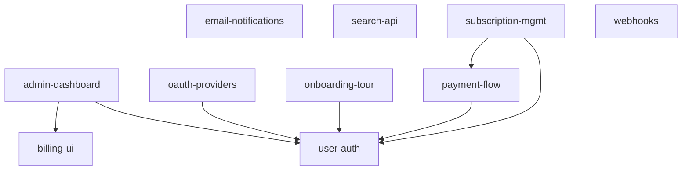

<!-- ZETTELGEIST:AUTO-GENERATED BELOW — do not edit -->

## State

| Spec | Status | Progress | Blocked by |
|------|--------|----------|------------|
| admin-dashboard | in-progress | 0/8 | — |
| billing-ui | planned | 0/0 | — |
| email-notifications | cancelled | 0/0 | Superseded by `webhooks`. Customers consistently asked for a structured event stream they could route themselves rather than another email firehose. See the `webhooks` spec for the replacement. |
| oauth-providers | planned | 0/4 | — |
| onboarding-tour | in-review | 6/6 | — |
| payment-flow | blocked | 3/6 | Waiting on production Stripe credentials and a signed PSP agreement from finance. |
| search-api | in-progress | 1/6 | — |
| subscription-mgmt | in-review | 5/5 | — |
| user-auth | in-progress | 2/5 | — |
| webhooks | in-progress | 3/6 | — |

## Graph

