# Zettelgeist agent workflow

## When this applies

You are in a Zettelgeist repo if **`.zettelgeist.yaml`** exists at the
repo root. Specs live under the `specs_dir` declared there (default
`specs/`). Each spec is a folder named `[a-z0-9-]+` containing some
mix of `requirements.md`, `tasks.md`, `handoff.md`, and `lenses/*.md`.

If `.zettelgeist.yaml` is absent: this skill does not apply. Use normal
tools. Do **not** invent a `.zettelgeist.yaml` to make this skill apply.

## Core model — three things to keep in your head

1. **The repo is the database.** Every spec, every status, every task
   tick is a markdown file in git. There is no separate state store.
2. **Every action is a commit.** Mutating tools (`tick_task`,
   `set_status`, `write_spec_file`, etc.) write the file *and* commit
   it. You do not stage or commit by hand for spec edits.
3. **`INDEX.md` is generated; never edit it.** It is rewritten on
   every commit by the pre-commit hook (or on demand via
   `regenerate_index`). Anything you write below the
   `<!-- ZETTELGEIST:AUTO-GENERATED BELOW — do not edit -->` marker
   is overwritten. The region *above* the marker is yours.

## The agent loop

Use this loop for any task that touches specs. Skip steps that don't
apply, but keep the order.

```dot
digraph zg {
    rankdir=LR;
    list [label="1. list_specs\n(orient)"];
    read [label="2. read_spec\n(load context)"];
    claim [label="3. claim_spec\n(reserve work)"];
    work [label="4. mutate\n(tick / write / set_status)"];
    validate [label="5. validate_repo\n(check invariants)"];
    handoff [label="6. write_handoff\n(record what you did)"];
    release [label="7. release_spec\n(free claim)"];

    list -> read -> claim -> work -> validate;
    validate -> work [label="errors" style=dashed];
    validate -> handoff -> release;
}
```



### 1. Orient with `list_specs`

Always start here. It returns `[{name, status, progress, blockedBy}]`
for every spec. You'll learn what work exists, what's already in
progress, and what's blocked. If the repo has no specs yet, list is
empty — that's fine; create the first one with `write_spec_file`.

### 2. Read before writing

`read_spec({name})` returns the full bundle: frontmatter, requirements,
tasks, handoff, lenses. Read at least the spec you're about to touch
plus any spec it `depends_on`. Do not paraphrase from memory — the
files on disk are authoritative.

### 3. Claim before mutating

`claim_spec({name, agent_id})` writes a `.claim` file inside the spec
folder. This signals to other agents that you are working on it.
**Release with `release_spec({name})` when done**, including on error.
A stale `.claim` does not block mutations — but it does confuse the
next agent. Treat it like a lock you own.

### 4. Mutate through the typed tools

Prefer these in order:
- `tick_task` / `untick_task` for checkbox flips
- `set_status` for the seven status values (or `null` to clear)
- `patch_frontmatter` for everything else in the YAML front block
  (`depends_on`, `part_of`, `priority`, custom fields)
- `write_spec_file` for body content (requirements, lenses)
- `write_handoff` for the handoff note

`write_spec_file({name, relpath: "requirements.md", content})` is the
escape hatch. Use it when the typed tools don't fit. **Never** use it
to rewrite `INDEX.md` — that's a regeneration target.

### 5. Validate before declaring done

`validate_repo` returns `{errors: [{code, path, detail}]}`. The v0.1
codes are:

| Code | Meaning |
|------|---------|
| `E_INVALID_FRONTMATTER` | YAML failed to parse, or a required field has the wrong type |
| `E_EMPTY_SPEC` | a spec dir contains no markdown files anywhere inside |
| `E_CYCLE` | `depends_on` forms a cycle; `path` lists the involved specs |

If errors appear, fix them with the same tools, then validate again.
Do not call `release_spec` while errors remain.

### 6. Handoff is for the next reader

`write_handoff({name, content})` writes `handoff.md` — a free-form
note for the next human or agent. Be specific: what changed, what's
left, surprises encountered, branch / PR if relevant. The handoff is
the only place where prose context survives between sessions.

### 7. Release the claim

`release_spec({name})` removes `.claim`. Always do this — even on
failure. Other agents are waiting.

## Status derivation rules (read carefully)

When a spec has no explicit `status:` in its frontmatter, status is
**derived**:

```
counted = tasks without #skip
if counted is empty:        draft (or in-progress if .claim exists)
elif all counted checked:   in-review (done if branch is merged)
elif any counted checked:   in-progress
else:                       planned

frontmatter `status:` (any of the 7 values) ALWAYS overrides this.
```

Implications:
- Adding all `#skip` tags to every task does **not** mark a spec done.
- Ticking the last task moves it to `in-review`, not `done`. `done`
  requires the branch to be merged into the default branch.
- Dragging a card on the board writes `status:` explicitly — that
  override sticks until cleared with `set_status({status: null})`.

## Format rules you will get wrong if you don't read this

| Rule | Why |
|------|-----|
| Spec names match `^[a-z0-9-]+$` | Anything else (unicode, uppercase, underscores, dots) is silently skipped by the loader. The validator may still flag bad frontmatter inside, so a typo can produce error messages about a "missing" spec. |
| The 7 valid statuses are exactly: `draft`, `planned`, `in-progress`, `in-review`, `done`, `blocked`, `cancelled` | Any other value in `status:` is treated as "not set" and falls through to derivation. |
| Task lines match `^[\s>]*[-*+]\s+\[([ xX])\]\s+.*$` | `[]` (no space), `[  ]` (two spaces), and CRLF line endings all fail this regex. A `tasks.md` saved with Windows line endings parses to zero tasks. |
| Task lines inside fenced code blocks **still parse as tasks** | The parser is line-based and not fence-aware. Quote sample task syntax in prose, not in ```` ``` ```` blocks. |
| `depends_on` must be a YAML list; a scalar string is ignored | `depends_on: other-spec` produces no edge. Use `depends_on: [other-spec]`. |
| `#skip` tags exclude a task from progress counting | `0/0` after `#skip`-ing every task means "nothing to do", not "done". |
| `blocked_by` is free text | Write a reason a human (or agent) can act on, not a ticket ID without context. |

For exhaustive behavior pinned down with input/output fixtures, see
`spec/conformance/fixtures/` in the Zettelgeist source repo (42
byte-exact scenarios as of v0.1).

## Choosing a surface

Zettelgeist exposes the same operations through three surfaces. Pick
based on what you have:

| Surface | When to use |
|---------|-------------|
| **MCP server** (`zettelgeist-mcp`) | Default for agents. 16 tools, typed args, structured errors. |
| **REST API** (`zettelgeist serve` then `http://localhost:7681/api/...`) | When the agent runs outside MCP, or when a human is sharing the viewer. |
| **CLI** (`zettelgeist regen`, `validate`, `install-hook`, `export-doc`) | One-off scripts, CI checks, initial setup. Not for per-action mutations. |

All three preserve the commit-per-action invariant.

## Creating a new spec

```
write_spec_file({
  name: "user-auth",
  relpath: "requirements.md",
  content: "---\nstatus: draft\n---\n# User auth\n\nEARS-style requirements...\n"
})
write_spec_file({
  name: "user-auth",
  relpath: "tasks.md",
  content: "- [ ] Design schema\n- [ ] Wire signup endpoint\n"
})
```

The spec name comes from the `name` arg, **not** from the markdown
heading. The folder is created automatically.

## Common mistakes (and what to do instead)

| Mistake | Fix |
|---------|-----|
| Editing `INDEX.md` directly | Edit `requirements.md` / `tasks.md` / frontmatter; INDEX regenerates. |
| Forgetting `release_spec` | Always release, even on error. Wrap in try/finally if your agent runtime supports it. |
| `set_status({status: "in-progress"})` to "show I'm working" | That's what `claim_spec` is for. Status overrides are for terminal/blocking states (`blocked`, `cancelled`, `done`) or human board moves. |
| Using `patch_frontmatter` to set `status` or `blocked_by` | Use `set_status` — it routes through a single code path and rejects invalid values. `patch_frontmatter` deliberately forbids these keys. |
| Writing task counts ("3/5 done") into the handoff prose | Counts live in `tasks.md` and are computed on read. The handoff is for context that isn't already in the files. |
| Trying to express "blocks B" via frontmatter on A | The graph is `depends_on` only. If A blocks B, write `depends_on: [a]` on B. The viewer computes the reverse edges. |
| Hand-rolling CRLF or BOM-prefixed markdown | The format is UTF-8 + LF. Other encodings parse incorrectly (CRLF kills task detection). |

## When you genuinely cannot proceed

- **The repo isn't initialized**: `.zettelgeist.yaml` is missing.
  Don't fake it. Tell the user: `zettelgeist install-hook` won't run
  without it; ask whether to initialize.
- **You hit a cycle**: read all involved specs, propose a break, and
  ask the user before deleting any `depends_on` edge.
- **A pre-existing claim is yours from a prior session**: release it
  and re-claim. Don't work under someone else's `agent_id`.

## Quick reference

```
list_specs                                            # what's here
read_spec({name})                                     # full bundle
claim_spec({name, agent_id})                          # lock
tick_task({name, n}) / untick_task({name, n})         # checkbox
set_status({name, status, reason?})                   # status (use null to clear)
patch_frontmatter({name, patch})                      # other fm fields
write_spec_file({name, relpath, content})             # body content
write_handoff({name, content})                        # context for next reader
validate_repo                                         # invariants
release_spec({name})                                  # unlock
regenerate_index                                      # only if INDEX got out of sync
```
