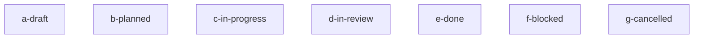

<!-- ZETTELGEIST:AUTO-GENERATED BELOW — do not edit -->

## State

| Spec | Status | Progress | Blocked by |
|------|--------|----------|------------|
| a-draft | draft | 0/0 | — |
| b-planned | planned | 0/0 | — |
| c-in-progress | in-progress | 0/0 | — |
| d-in-review | in-review | 0/0 | — |
| e-done | done | 0/0 | — |
| f-blocked | blocked | 0/0 | waiting on external API decision |
| g-cancelled | cancelled | 0/0 | — |

## Graph

