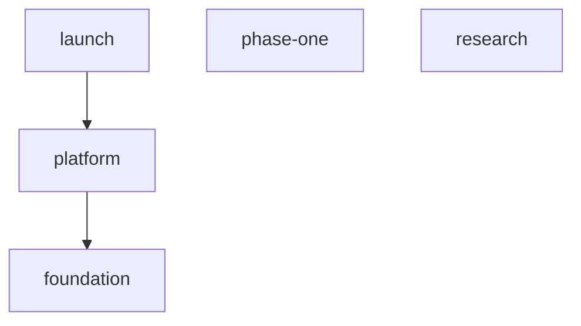

# Project INDEX

This document is auto-generated below the marker, but the human-authored
preamble (this section) is preserved across regenerations.

## Goals

- Ship phase one features safely.
- Track research separately.

<!-- ZETTELGEIST:AUTO-GENERATED BELOW — do not edit -->

## State

| Spec | Status | Progress | Blocked by |
|------|--------|----------|------------|
| foundation | in-review | 3/3 | — |
| launch | blocked | 0/0 | platform integration tests pass |
| phase-one | draft | 0/0 | — |
| platform | in-progress | 1/3 | — |
| research | cancelled | 0/0 | — |

## Graph

