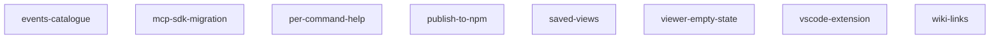

<!-- ZETTELGEIST:AUTO-GENERATED BELOW — do not edit -->

## State

| Spec | Status | Progress | Blocked by |
|------|--------|----------|------------|
| events-catalogue | planned | 0/7 | — |
| mcp-sdk-migration | planned | 0/6 | — |
| per-command-help | in-review | 5/5 | — |
| publish-to-npm | planned | 0/7 | — |
| saved-views | planned | 0/8 | — |
| viewer-empty-state | planned | 0/5 | — |
| vscode-extension | planned | 0/7 | — |
| wiki-links | planned | 0/8 | — |

## Graph

