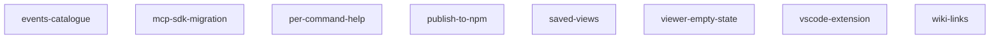

<!-- ZETTELGEIST:AUTO-GENERATED BELOW — do not edit -->

## State

| Spec | Status | Progress | Blocked by |
|------|--------|----------|------------|
| events-catalogue | planned | 0/7 | — |
| mcp-sdk-migration | planned | 0/6 | — |
| per-command-help | in-review | 5/5 | — |
| publish-to-npm | planned | 0/7 | — |
| saved-views | cancelled | 0/8 | Cancelled in favor of the agent-first thesis. The premise of saved views was that users want to maintain a library of named filters over the spec set. In a workflow where every user has an LLM agent in hand and MCP exposes `prepare_synthesis_context`, "show me blocked specs in payments" is one prompt — there's no value in persisting that as a configuration artifact. `part_of` already exists for declaring "this group of specs is meaningful," and git history is queryable by the agent directly. Keeping this doc as a record of the decision; not scheduled for any release. |
| viewer-empty-state | planned | 0/5 | — |
| vscode-extension | planned | 0/7 | — |
| wiki-links | planned | 0/8 | — |

## Graph

